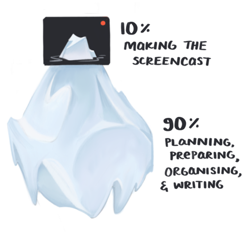

# Prepare your screen for recording

**Success on egghead comes down to mechanics**. This guide will help you nail the technical aspects of presentation and accessibility, so you can present lessons that are visually clear and accessible for all learners and devices.

Screencasting isn’t easy. It’s a difficult skill to nail—and on top of that, we’re very picky about the screencasts we publish on egghead.io. We can’t publish screencasts with small fonts, blurry text, and low-contrast color schemes that distract from learning. While egghead screencasts are diverse, they must also share a sameness of quality and presentation.

Watch this video on removing distractions:

<ResponsiveEmbed src="https://egghead.io/lessons/tools-remove-distractions/embed" />

**Always remember accessibility.** A wide range of people will access your lessons on a variety of devices of varying quality. Maximizing the legibility of the code you present helps all learners absorb the information to the best of their abilities.

### Set your settings

Before you do anything else, adopt these settings:

- 1280x720 (720p)
- 16:9 aspect ratio
- Stereo audio ([you’ll set up your audio next](/set-up-your-audio))
- For best results, use HiDPI mode on your monitor

We deliver content at 720p (1280x720 in pixels). We want this to be a crisp and legible output for the viewer, whether they’re expanding lessons fullscreen on a 65" TV screen or watching them on the bus.

This video shows you how to prepare the screen and mic to do just that

<ResponsiveEmbed src="https://egghead.io/lessons/tools-prepare-to-record-screen-resolution-and-mic-check/embed" />

HiDPI mode—also known broadly as DPI scaling, or Retina display on Macs—doubles each pixel, allowing for highly readable text on very high-resolution screens. Use it if possible!


### DPI scaling on Windows

On Windows, we've had success boosting the code fonts to max out the screen. Aspect ratio is key here, so set your screen to the highest 16x9 resolution and kick the fonts up.

Using DPI scaling features is helpful—you can scale the OS chrome and make UI more legible.

[This article](http://www.eizoglobal.com/support/compatibility/dpi_scaling_settings_windows/) can tell you more about pixel scaling on Windows.

### Access HiDPI mode on macOS

On Mac, you’ll get the best results if you record at **1280x720(HiDPI) mode**. This resolution is achievable on 27" monitors and Retina MBPs. It effectively gives you a visible resolution of 1280x720, but it’s extremely crisp and readable on phones and tablets.

This mode is "hidden" by default. You can achieve it on a Mac with a software tool that exposes the option, like the **RDM tool**. On Retina MacBooks, the option works automatically. For external monitors, or non-Retina Macs, follow these instructions to enable HiDPI mode:


Another application that works well is [**SwitchRezX**](http://www.madrau.com/). It's shareware and requires a fee. If you can't use this mode, recording at normal **1280x720** or **2560x1440** are workable substitutes.

By constraining to this small window, you can fill the screen effectively for coding screencasts. The most import thing to get correct is the aspect ratio. We don't want to present with any black bars around the screen. We want to give the user maximum code visibility at all times.

### Screen and code layout

The code is the champion of an egghead.io screencast, so it must be comfortably readable for all learners.

- **Maximum space:** Give your code maximum horizontal space by using an 80- or 120-character "column" for the code and bumping the font size up to fit.
- **Padding:** Allow some padding for the top and bottom of the recording window, which could get cut off by Player Chrome. For instance, if you're recording the terminal, commands toward the bottom might not be visible. You don’t want to frustrate or distract your viewers.
- **3-column layout:** We will typically work in a 3-column layout, with the editor taking up 2/3s and a browser on the right side in the remaining 1/3 of the screen. You might prefer to flip back and forth between the browser and the editor—up to you!


We prefer this 2:1 ratio of code:example. It will look something like:


Notice that the code's font size has been increased to **maximize the space available.**

Place your **example on the right**, occupying 1/3rd of the screen. Consider that your example will need to fit in that space when you’re creating it. Choose a simple example with a minimally responsive layout, and you’ll be just fine.

In some cases, the example is replaced by a terminal, or a terminal window shares the right column with the example. In this latter case, the terminal window would be on the bottom-right section of your screen.

Remember that your lesson viewers are here to see the code. Make it the starring feature!

#### Visual Studio Code settings

If you are using VSCode, egghead instructor [Andy Van Slaars](https://twitter.com/avanslaars) has put together a [GitHub repo with a screencasting profile](https://github.com/avanslaars/code-profiles) that loads the settings he uses when recording screencasts.

Here are some more settings that help remove some of the distractions:

```
"editor.minimap.enabled": false,
"explorer.confirmDragAndDrop": false,
"editor.fontSize": 18,
"terminal.integrated.fontSize": 18,
"workbench.activityBar.visible": false,
"editor.quickSuggestions": false,
"editor.suggestOnTriggerCharacters": false,
"editor.wordBasedSuggestions": false,
"editor.quickSuggestionsDelay": 1000000,
"editor.parameterHints.enabled": false
```

### Command line prompt

If you will be showing your command line, we suggest using a minimal prompt to reduce distractions. This example prompt works well for screencasting:


You can use this one by updating your `~/.bashrc` or `~/.zshrc` with the following:

```bash
export PS1="\n\[\e[32m\]\W\n\[\e[m\]\[\e[34m\]\\$\[\e[m\]"
```

Note: If you’re on Mac and using Bash, you also need to add a `~/.bash_profile` with this:

`source $HOME/.bashrc`

This tells Mac to load your `~/.bashrc` when loading a terminal emulator.

Now that your screen is ready to record, sound up. Time to get your audio ready.

# Set up your audio

Good audio starts with quality gear. Your laptop’s built-in microphone sounds decent, but we want you to sound way better than decent.

When you become an egghead instructor, we hook you up! As soon as you have a draft lesson almost ready to publish, we’ll send you a waterproof Pelican case full of professional-grade audio recording equipment. 📬


Here’s what you’ll be getting:

- K & M 23150-500-55 tabletop microphone stand with 5/8" threaded connector and mini boom arm
- Shure BETA 87A microphone
- Shock mount to attach the mic to the stand
- Shure X2U XLR-to-USB signal adapter
- 1 XLR cable to connect the microphone to the USB interface
- Badass by Kathy Sierra (to inspire your great ideas)


Let’s go through each piece of equipment and explain how you’ll use it.

### Microphone boom


The boom is a stand for your mic. Booms can range in size and shape. (Action movies require bigger booms than egghead lessons.) This is a very nice, sturdy boom from Germany that folds down for easy storage in the case.

### The microphone


Obviously an important piece of equipment! The **Shure BETA 87a** is a [supercardioid](http://blog.shure.com/multi-pattern-microphones-what-where-and-how/) mic, which refers to how it picks up sound: It’s forgiving and blocks out ambient noise.

You can go crazy with mics, spending a huge amount for a smidge better sound quality. You might not use this mic to record a #1 banger, but it still fits into the "sounds very good" column. 👍

Positioning of the mic is important. You should be 2–6 inches away for optimal volume levels. For extra credit, here are loads more positioning tips:


(We don’t really give out extra credit, but you might sound _slightly_ better.)

### Shock mount (right)


This little piece connects to the boom, and the microphone slides into it before being attached to the XLR cable. It will dampen any footsteps or other vibrations that might be picked up through the stand to the mic. (You’ll most likely be sitting down, but who knows what your kids or roommates are up to.)

### USB audio interface (left)

The mic we’re giving you is built for professional audio applications, not necessarily for capturing audio on a computer. This interface connects the mic to your computer, and converts XLR analog signal into 1s and 0s for the computer to store. It has an XLR input (from the mic) and a USB output (to the computer).

Note:
⚡️ The 48v power button needs to be on!
⚡️ Turn the gain up!

### XLR cable

XLR is a plug used in professional audio applications. It isn't completely necessary since the pre-amp will plug directly into the microphone, but play around and see if it makes your sound more stable.


Your final setup should look something like this:


### Check audio input levels

Once your gear is set up, you'll need to check the audio input levels to make sure your gain is set properly. Here’s a lesson to help you:

<ResponsiveEmbed src="https://egghead.io/lessons/tools-prepare-to-record-screen-resolution-and-mic-check/embed" />

Ta-da! You’re ready to record.

# Record your lesson

Screencasting is one of those iceberg-like tasks: 90% of the work is behind the scenes. Only 10% is visible.



Recording your screencast is that 10%. You’ve put tons of thought and time into your lesson scope, code example, and points you want to cover. What distinguishes your success in this final stage is high-quality technical tools. (And careful editing—that’s next.)

### Video capture

egghead.io instructors are provided with whatever software licenses you need. Just #ask!

**On Windows**, the best option for video capture and editing is [Camtasia](https://www.techsmith.com/video-editor.html).

**On a Mac**, the best options are [ScreenFlow](https://www.telestream.net/screenflow/) and [Camtasia](https://www.techsmith.com/video-editor.html). Both provide editing features. We tend to prefer ScreenFlow for its standalone simplicity, as Joe Maddalone shows in the video show below, but the decision is completely yours.

[](https://www.youtube.com/watch?v=3nlJ_wP9dPE&&index=5&list=PL219naRJXQKbQJ60WxsuGfTFv7_fvna51)

### Capturing audio

There are three ways to record your screencasts. Each is completely 👌

- All at once
- Audio first, video second
- Video first, audio second

**All at once** is arguably the simplest approach—just type and record the screen. You don't have to think about the video and audio separately. You just have to think about them at the same time, which might be a lot to ask. Give it a try and see how it feels to you!

**Audio first** means you play back the audio and record your video to match. The trick here is remembering what is said when, so your mouse is ready to move where it needs to.

**Video first** means you narrate over video playback. It can be challenging to sync and get a natural feeling with narration. Like most things, it takes practice.

For more on audio, see our guide to [audio setup](/set-up-your-audio).

### Record one thought at a time

While you’re recording, do your editing-self a favor: Record in short, high-quality chunks, one thought at a time.

Think of your lesson as a series of paragraphs that take 20 seconds to record. **Between each, take a pause**. Doing this will help you avoid intense editing to move audio and video snippets around as you build your quilt-like final product.


When you record in chunks, you get better short takes. (You’re not trying to set a record for the longest unedited take here.) By pausing between each section, you can visibly see where you need to [ripple delete](/edit-your-lesson).

Need an example? Watch John Lindquist show how to record one thought at a time:

<ResponsiveEmbed src="https://egghead.io/lessons/tools-record-one-thought-at-a-time/embed" />

# Edit your lesson

Editing is your lesson’s critical last stop between you and your audience. It’s your quality filter.

### Ripple delete

⚡️Ripple delete is your greatest ally. ⚡️ It’s basically deleting the bad parts, a chunk of seconds at a time—like that tangent you go on, that five-second period where you stammer over a word, and those dozens of “umm”s and “like”s you had no idea you said so often. Ripple delete couldn’t be easier or more essential, and it’s available in both Camtasia and Screenflow. 🙌

In the egghead lesson shown below, John Lindquist shows how he uses ripple delete to trim a video from 7:28 to 2:17. Yes, really.

<ResponsiveEmbed src="https://egghead.io/lessons/tools-edit-with-ripple-delete/embed" />

## ⚡️ speed up/slow down video

Sometimes you want to speed over some unimportant parts or slow down important parts. You can do this in a controlled percentage wide format in Screenflow ([instructions here](https://www.youtube.com/watch?v=Pu4b-ECFAYk)).

Alternatively, you can do it interactively by holding down `Option` while dragging the edges of a clip to do the same thing. Sped up clips will show a :rabbit2: and slowed clips will have a :turtle:. This is handy for stretching or shrinking a clip to be a specific size, **and** you can do it with multiple clips at once.


## ⚡️ annotate video

You can annotate your videos with arrows and boxes by using the Annotations tool in the top right in the inspector pane.


They act like regular video clips so you can fade them in and out, apply animations, etc.

### Editing with Premiere

In time, you can 💥 kick it up a notch 💥 with more sophisticated editing software like Adobe Premiere. Premiere has some significant advantages, but it also has a steep learning curve. We recommend starting simple, and leveling up to a non-linear editing system like Premiere later. If you’re interested, see how some of our advanced instructors use Premiere:

- [Editing with John Lindquist](https://www.youtube.com/watch?v=_YqhKP-yZzo&index=1&list=PL219naRJXQKbQJ60WxsuGfTFv7_fvna51)
- [Going through the process with JS Leonard](https://www.youtube.com/watch?v=faINApx4-4g&list=PL219naRJXQKbQJ60WxsuGfTFv7_fvna51&index=2)
- [Voiceover and editing with Joel Hooks](https://www.youtube.com/watch?v=faINApx4-4g&list=PL219naRJXQKbQJ60WxsuGfTFv7_fvna51&index=2)

### The easiest way to edit is to capture it well

In traditional videography, “in-camera editing” refers to the idea of capturing content so well, it doesn’t need to be edited much at all.

Your first few lessons will feel like a major effort to produce because you have to consider so many different things. You’re teaching complex concepts (web development) and learning complex concepts (screencasting) at the same time.

Believe us: You’ll get better. And better. And better. Just keep practicing and keep recording.

Need help or advice? Please, #ask! You aren’t the first person to do this or struggle at it. Your coach and the other friendly folks on Slack were all in your shoes once, and now we’re here to help you succeed.

# Sharing your code

Playing around with code is critical to becoming a better web developer.

For every egghead lesson, we provide a concise, organized, readable code example below the lesson video in a runnable embed, using Plunker or a similar service. That way, egghead members can jump in right away.

Note: You should always record in a local environment using your favorite text editor, and then repurpose your code using Plunker or your service of choice. You do you!

### Using Plunker

Plunker allows us to embed even fairly complex apps as runnable examples, perfect for our learners to run with. There are two ways to use it:

- You’ll typically use **Plunker’s public UI** and set up your code example there. For standalone lessons, feel free to just do this. It works great.
- Plunker also supports loading your code **directly into the embed via Github**. This is an amazing feature that allows us to version control the examples presented to the user. egghead can then handle maintenance on your examples and keep them updated and supported for a much longer time. :muscle:

Much as we love Plunker, there are cases where it just won’t work. In those cases, simply link to a GitHub repository.

### Link a Plunker embed to a GitHub repo

Linking a GitHub repository to Plunker is fairly simple and involves configuring the Plunker embed url. We start with https://embed.plnkr.co/ , which is the base embed url. To link to Github we configure the url by adding:

`https://embed.plnkr.co/github/{profile-name}/{repository}/{branch}``

`{branch}` can be replaced with `{tag|sha1}` depending on how your repo is set up. If your repo is set up with an example in individual folders, you can add that `/path` to the embed url.

[Here’s an example Github repo](https://github.com/eggheadio-projects/nlp-in-javascript-with-natural), which is divided into one folder per lesson.


### Additional Plunker embed config

URL parameters can be added to affect how the embed presents itself. The most-used feature is showing specific files (the default being the index and preview). Add `?show=` to the end of the url with the various filenames separated by commas.

`https://embed.plnkr.co/github/eggheadio-projects/egghead-wikipedia-demo/angular-2-building`

You’ll see a complex example of this [here](https://embed.plnkr.co/github/eggheadio-projects/egghead-wikipedia-demo/angular-2-building-an-instant-search-with-angular-2-combining-observables-with-flatmap?preview=plnkr.html&show=src%2Fapp%2Fapp.component.ts,preview).

If you want to go wild, [this gist documents](https://ggoodman.gitbooks.io/plunker/content/embed.html) quite a few additional parameters you can use.

### Build complex apps in Plunker

Before you go any further, **stop!** You don’t need to build apps in Plunker. egghead will do this for you. Just hit up @zac in Slack and we’ll get to it.

...but if you’re the DIY type, this is actually pretty cool.

Plunker itself doesn’t support the node file system—import and export statements in Plunker will not work. But it is possible to create an in-browser Typescript compiler. This is usually required for Angular lesson examples. Doing this takes a bit of set up, so hang in there!

Here’s what you do.

**1)** Install jspm on your local machine if it isn’t already. It’s an auto-configure systemjs tool:
`$ npm i -g jspm@beta`

**2)** Run in whatever dir pleases you:
`$ jspm init`

**3)** Select all the defaults given to you. Then run:
`$ jspm i npm:{package_you_want_to_install}`
For instance: `jspm i npm:data.task` This will give a verbose working example of the config file needed to achieve in-browser compiling.

**4)** After init is done, this is the barebones .html page you will need:


**5)** You then need to create an `app.js` file in the `src` directory `src/app.js` . This file will contain the code you want to run. Any packages that are installed using
`jspm i npm:{package_you_want_to_install}` will create a `jspm_packages/npm/{package_you_want_to_install}@1.2.3.json` file.

**6)** ⚡️ Copy those contents. ⚡️
The content will be placed in your `SystemJS.config` under the packages property as the package you installed. For instance:


**7)** Jspm will also give you a `jspm.config.js` file: Copy this file, with some slight modifications.


Note that the `"baseURL":` property was changed from `/` to a `.`

Also note that
`"systemjs-babel-build": "npm:systemjs-plugin-babel/systemjs-babel-browser.js` **line was added under the** `map` property (nested in the `devConfig` property).

**8)** For Plunker apps, just add this script tag (in `index.html` ): `<scriptsrc="https://unpkg.com/systemjs@0.19.41/dist/system.src.js"></script>`

**9)** Then the two `SystemJS.config` objects can be added in their own script. Now you’re good to go!

Here’s [one last example of a Plunker embed](http://embed.plnkr.co/UxkIoIK9PEkaupwTInDE?show=script.js,preview) to send you on your way.

# Host a demo REST API

Want data to play around with in your next egghead lesson?

egghead co-founder and instructor extraordinaire John Lindquist set us up with a REST API using [swapi](https://swapi.co/) (The Star Wars API) and [json-server](https://github.com/johnlindquist/swapi-json-server). As long as you don’t openly endorse or promote swapi (or Star Wars), you’ll have no issues with copyrights.

If you don’t have a need for any special configurations, you can spin up the server using [npx](https://github.com/zkat/npx).

npx ships with the latest versions of npm, so you probably already have it installed.

`$ npx https://github.com/johnlindquist/swapi-json-server`
`// --> http://localhost:3000`

💥 Presto. You’re now running a REST API using Star Wars data. 💥

### Build custom data for egghead lessons

Of course, you have endless options for building a REST API.

If your data needs to be unique for the lesson you’re crafting (there’s a lesson for that!)

John shows us how to generate a large dataset of JSON data:

<ResponsiveEmbed src="https://egghead.io/lessons/javascript-creating-demo-apis-with-json-server/embed" />

### 100 random people

If 100 random people is enough for your data set, grab this gist: [100 people in JSON format](https://gist.github.com/johnlindquist/3a7d28dbf231c476d62dd3f481d7b1c5).

### Serve JSON locally

`json-server` will serve any JSON file we have ready.

`$ npm i -g json-server`

`$ json-server {data.json}`

You're good to go.

### Host a REST API

Zeit's [now](https://zeit.co/now) feature is a great way to host any application needing it.

You can use the now command with an app John set up:

`$ npm i -g now`
`$ now https://github.com/johnlindquist/swapi-json-server`

If this is your first time using now, there will be a small amount of setup, but overall it's a breeze.

There’s a lesson for that, too. Check out [Deploy Web Apps with Zeit Now](https://egghead.io/courses/deploy-web-apps-with-zeit-now) for an in-depth look at `now`. Watch it right now!
