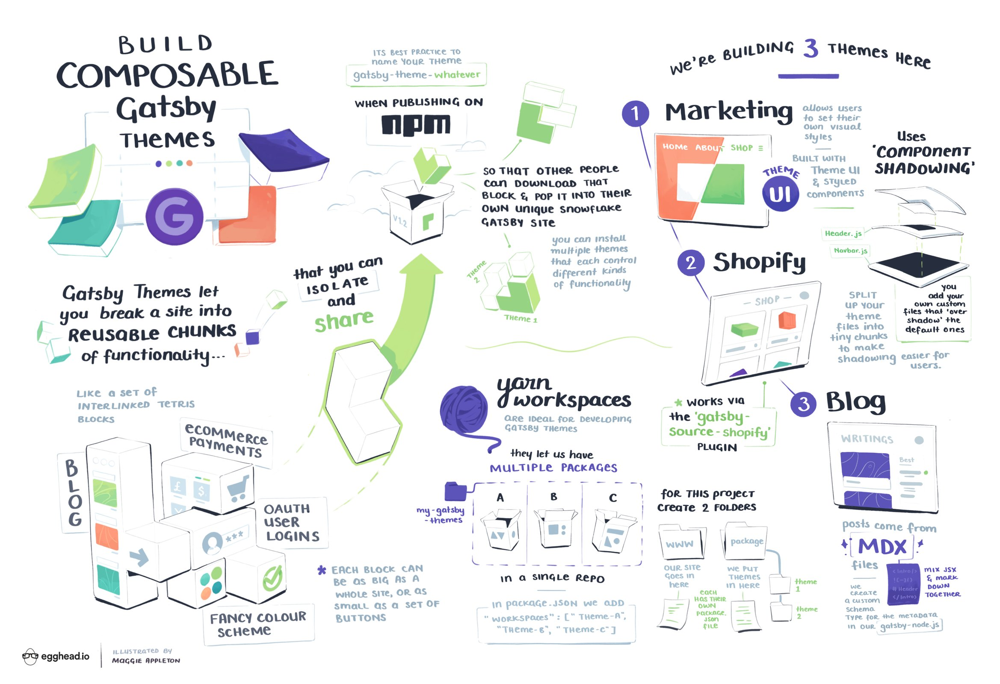

Chris is prominent in the JavaScript community and a leading expert in serverless and Jamstack. On top of his work as an independent consultant, Chris consistently puts out a steady stream of content to teach what he knows to help other developers in their learning. Before becoming an egghead instructor, Chris was already very active in sharing his knowledge by [writing articles](https://www.christopherbiscardi.com/) and [streaming](https://www.twitch.tv/chrisbiscardi) and created the [Party Corgi Network](https://www.partycorgi.com/) (an inclusive community of developers/content creators helping each other grow).

While Chris is a powerhouse at putting out great content, it wasn't always that way. He started out writing blog posts several years ago and he says he spent a long time not being very good at it. If you ask him what's the key to getting to a place where you're regularly shipping good content, Chris says it's being willing to make mistakes and to put out more and more content.

> **"There's no sort of magic,"** he says. "I sucked at it for a long time. It's just I did it a bunch and eventually, I got better. Now, I shipped over a hundred blog posts last year and I'm over a hundred screencasts."

Chris was considering what kinds of informational product formats he could use to share his extensive knowledge of Jamstack when we invited him to teach on egghead. His main hesitation to becoming an egghead instructor was his lack of familiarity with the platform.

> "I had never seen egghead before. I'd never used it," he says. "I also didn't know anything about how they worked. **I'm aware there are predatory publishing deals out there and I didn't want to put myself in one of those. Turns out that none of my concerns were warranted and egghead is awesome.** I keep all the IP to all my content, which is wonderful."

# Providing an established platform and just the right level of support to publish content

We provide the platform and processes to help instructors like Chris produce everything from one-off lessons to collections to live workshops and courses. As an experienced content creator, Chris didn't require much in terms of coaching to start producing egghead screencasts. After he went through the instructor onboarding, he picked up on the egghead style very quickly with few tweaks.

While he often doesn't need much in terms of guidance or structure to produce one-off lessons or collections, he appreciates the support is there when he needs it and that he can workshop content with an egghead team member when he isn't quite sure what direction to take.

> "The ability to hop on a chat with any of them and just be like, **'Hey, I'm thinking about making this. You've seen a lot more courses than I have. Can you give me some feedback on this or the idea or the structure of things?'** That's been super useful."

As part of the process of creating his course ([Composable Gatsby Themes](https://egghead.io/courses/composable-gatsby-themes)), we worked with Chris to help him test out the content with interested learners through a live workshop on the topic. We handled all the workshop promotion and ticket sales so he could focus on putting together the content.

Chris appreciates the higher levels of marketing and production support that egghead provides for workshops and courses to create an effective and awesome learning experience (such as the top-notch illustrations and sketch notes that egghead Illustrator & Art Director Maggie Appleton provides).

> **"As I put more effort in, egghead puts more effort in, which is really nice,**" he says. "I can ship a one-off thing or a small impromptu set of content more on my own. But if I also want to do something more intentional, **egghead will show up in terms of the production process and the marketing process."**

_Sketch notes by Maggie Appleton for Chris Biscardi's workshop (Building Composable Gatsby Themes)._

Chris is great at putting out really solid collections. We collaborated with him to experiment with a new format for promoting instructor content where we package together interrelated collections. 

> "**My end intent is to ship something like this, but on a larger, more polished scale, so it's nice to have this as a stepping stone,**" Chris says. "It shows all of this stuff that I'm doing does fit together and you can go through it all rather than me having to point people to five different playlists or something like that."

# "It can grow into a full-time job if I want it to..."

Between his course, collections, and one-off lessons, Chris published a total of 115 lessons through egghead in his first 16 months as an instructor. In fact he's built up so much content, he can almost answer any question that someone asks by pointing them to an egghead collection he's created that can take them from zero to being able to do the thing they're trying to learn.

Collaborating with egghead has the benefit of providing a bit of extra income, which Chris can see growing as our collaboration helps him build a foundation to eventually transition away from consulting.

> **"I want to move more towards selling informational products or educational material I've built rather than selling my time for money,"** he says. "That's really where egghead comes in for me. It's a stepping stone on that path. There's a lot of work to do there for me personally, but **I have seen that it can grow into even a full-time job if I want it to.** I get to choose how much investment I want to put into it and how much I want to get out of it."

Chris has long seen the benefits of publishing content and is big on building efficient workflows. He's found adding egghead screencasts to the mix fits in well with writing blog posts and streaming and makes it easier for him to build and put content out there more consistently. He's got a process of taking notes while he codes or researches, turning them into a blog post, then turning that blog post into an egghead lesson. He'll then take some of those smaller pieces and edit and polish them together into a single larger post and an egghead collection or a course in order to do a deep dive on one particular topic.

> "Not only am I getting an opportunity to build bigger ideas out of smaller ideas, but people will land on a blog post and be like, 'Oh, I can either watch a two minute video or I can read the blog post.' **People don't all learn the same way, so it's good to provide different options."**

Whether you are just getting started or have years of experience, Chris says he recommends collaborating with egghead, particularly for people like him that don't want to spend the time building their own platform and all the production, marketing and sales, and distribution work that goes with it.

> "I want to focus on the thing that's actually impactful, what I actually want to do, which is spend my time building the product," he says. "**So I let egghead take care of all the other stuff.** Once you actually get into it, you realize that there's a lot more to egghead than the platform and the people behind all the stuff are extremely great , extremely knowledgeable and extremely helpful."
