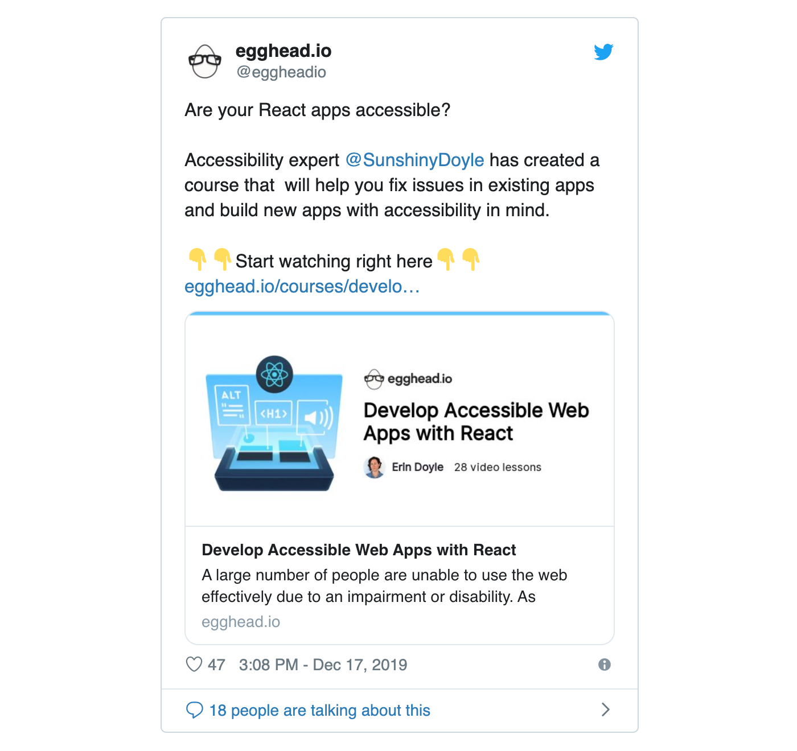
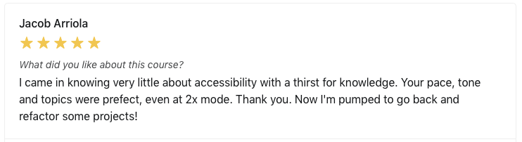
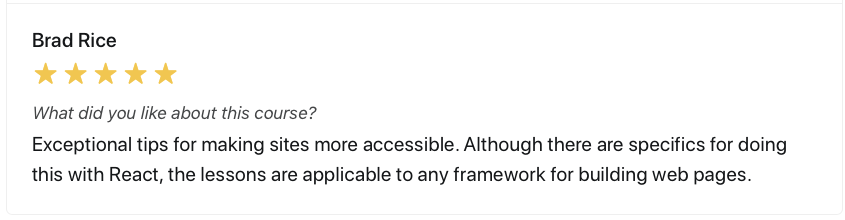
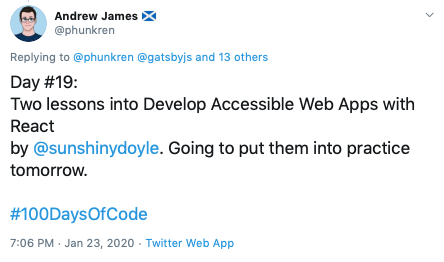

As a full-stack developer working for an e-commerce company that prioritizes creating an accessible experience, Erin has been immersed in designing web apps with accessibility in mind.

Making web apps accessible for users who have an impairment or disability can feel daunting for developers. There are lots of tools and techniques available to create an inclusive user experience and it's easy to get overwhelmed to try and navigate the incredibly broad landscape. Plus, there aren't a lot of definitive "right" or "wrong" ways to address accessibility.

> "I had to go through this journey myself and it was intimidating when I first started," Erin says. "I wanted to take what I learned going through that process and help others not have to go through the pain and overwhelming fear of 'how do I learn all these things?' **How can I make that easier for people so that they follow through instead of running away from the challenge?"**

Erin shared her expertise on the topic through teaching in-person workshops for developers, which led us to inviting her to teach on egghead.

Shortly after she came onboard as an instructor, we put out a call for instructor submissions for egghead's annual December promotion (12 Days of Badass Courses). Erin enthusiastically threw her hat in the ring, even though she was a little concerned about how much time and effort would be involved in creating a full course.

> "It was definitely daunting," she says. "Even though I built an entire workshop and had all this material, translating that into recorded videos was still a lot of work. **But how could I say no to this awesome opportunity?"**

# Providing a feedback loop + instructional design guidance

Erin began with her first 30-second demo lesson on how to use a test-driven development approach to address accessibility issues in an app. We went back and forth for several iterations, providing Erin a feedback loop at each step on what to adjust to deliver a value-packed video lesson.

> "With the feedback, I got a real good sense of what to do and what not to do," says Erin. **"The team is with you all along the way to make sure you're putting out the best quality and fit the egghead style and brand, which is really great because so much wisdom has gone into developing it."**

We then collaborated with Erin to help her translate the knowledge she shares through in-person workshops into a full egghead course. Through the planning process, we provided guidance in how to scope and structure the material and supported her in hosting her first online workshop. Erin then worked to transform the workshop experience into short, to-the-point egghead video lessons for her final course.

Each step of the way, we collaborated with Erin to identify the end goal for the learner and then design the material to match it — working through exactly what learners should know how to do once they've completed the course and what material to take them through so they acquire those skills.

> "The instructional design behind the process egghead has developed was like nothing I'd ever worked with before," Erin says. "**To put all of this intentional forethought into how do I take what I know and guarantee that people actually are learning these things by the end helped me a lot.** And I think it really helped the material be much more consumable."

# 🎉 Shipping her first course

Erin successfully published her first course — [Develop Accessible Web Apps with React](https://egghead.io/courses/develop-accessible-web-apps-with-react) — in December. In it, she provides a concrete and effective process for testing, refactoring and building web applications with accessibility in mind. The material gives developers a jump start on auditing and fixing accessibility issues in their apps and helps them better understand the user experience for people with differing abilities.

We handled the marketing for the course, featuring Erin's course during the 12 Days of Badass Courses and helping her promote it with an AMA on the egghead community forum.

Within the first couple months of its launch, Erin has received excellent reviews and feedback from learners on how helpful her lessons are and how excited they are to put them into action.

> "The feedback has been really humbling and mind-blowing," says Erin. "It's pretty awesome to see that I did an effective job and that people are learning. They're able to go away and have a really good grasp of the concepts."

# Deepened expertise, interacting with an amazing community, plus a career launching pad 🚀

Going through the process of creating and delivering the live workshop and the course, Erin not only learned more about how to be more effective in teaching others, but also expanded her knowledge on the topic she teaches. She says she came out of the process knowing way more about accessibility than she did before.

> **"Each new thing that I add to the material — or even if it's something I've talked about before — I want to make sure that I know as much as I can about it before I'm going to teach others**," she says. "Have there been any new developments since I talked about this last? How has the landscape changed? That's been a really awesome benefit that I didn't foresee going into it."

Erin's says it's also been enriching and a unique experience to be part of a community of developers that help each other out and one where learners have direct access to instructors.

> "egghead's doing so much to help people learn more effectively and creating this learn in public environment," she says. "When you sign up for an egghead subscription, you get a lot of support. **It gives me a warm fuzzy feeling to be part of that."**

With her course now out, Erin says she's gaining more notoriety for her expertise in accessibility. She's already seeing doors open as a result of some of the promotion we've done with her, such as being contacted for advice on accessibility, and is excited to expand her reach through other avenues of teaching as well as potentially building a business out of her expertise.

> "egghead has helped boost my career and my name in the industry," says Erin. "**I feel like I've got so many opportunities ahead of me to expand my reach and it's really just deciding which ones I want to pursue. The road is totally paved for me to go whichever direction I want to go.** It's just beginning at this point."
