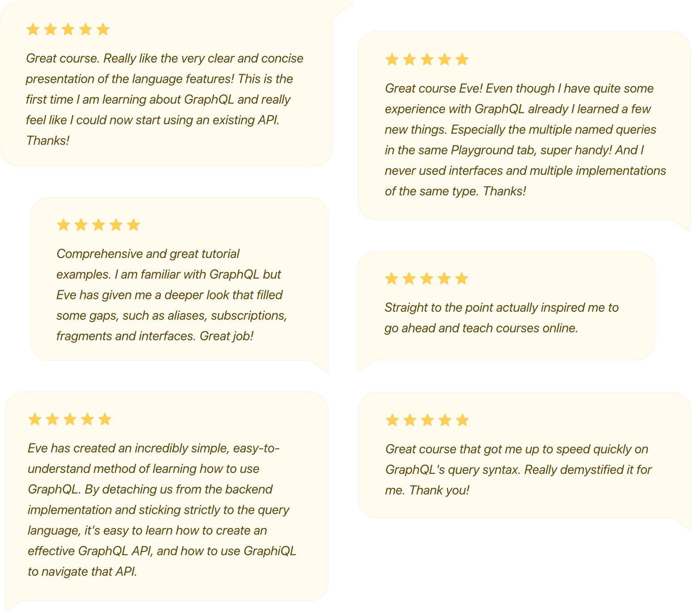

Eve Porcello is a performer. She's been teaching JavaScript, Node.js and GraphQL as a full-time trainer for more than eight years and has a talent for making learning fun, interesting and effective. Her background in theatre and sketch comedy likely comes as little surprise to those who have seen her present.

Eve and her partner Alex Banks co-founded [Moon Highway](https://moonhighway.com), their training and curriculum development company. They deliver engaging, hands-on programming courses, both in person and online.

Both Eve and Alex were already established in the GraphQL scene when our collaboration with them began in 2018. Not only had they taught a bunch of live workshops on the topic, they also co-authored O'Reilly's _[Learning GraphQL](https://www.oreilly.com/library/view/learning-graphql/9781492030706/)._

## Filling a gap in learning resources for GraphQL

GraphQL has been blowing up, but because it's still relatively new, there are far fewer learning resources than there are for topics such as JavaScript, Node or React. The resources that _are_ out there can be overwhelming for learners.

> "**It can be really tricky to know what's good, what's up to date, what uses the right stack for your organization**," says Eve. "I also think that a lot of the resources assume a lot of knowledge about GraphQL and don't put newcomers' goals and expectations and experience level in mind. They're just like, 'Here's all this stuff, we're going to bombard you with it.'"

Eve predicts that with all the benefits that large and small companies alike are finding with GraphQL, almost every developer, engineer or product manager will need to know at least some basics of GraphQL within the next couple years.

Eve has created a nice stack of GraphQL lessons on egghead, as well as an excellent 30-minute course to help people learn some of the features and vocabulary details of the language.

Even though Eve is an experienced and talented trainer, determining exactly what to cover in the video course still posed a challenge for her.

> "It's tricky sometimes to determine the scope of a course and figuring out what's appropriate for the audience," says Eve. "My focus in my work is curriculum development, so I really am obsessed with getting those details right."

## Collaborating on course building, emphasizing learner outcomes

We worked together with Eve to refine her course outline, approaching the design of the material from a student's perspective. We talked through exactly who the course is being designed for and what they should be able to do right after they take the course. We examined how Eve's existing examples and approaches could be adapted into the concise egghead format.

To test and practice the material, Eve taught the course through live workshops with learners — first a free one, then a paid one. We handled the all the workshop promotion and ticket sales so Eve could focus exclusively on teaching and refining the course material.

The experience of testing the material and the early feedback Eve received from learners gave her an opportunity to polish her video lessons into a killer final course — ensuring learners can take away everything they need over a lunch break.

> "Doing the workshops was a really nice way of vetting the content, **making sure the thing I make in my office is something that is actually valuable to people who are consuming it**," says Eve. "There are a lot of sink-or-swim training opportunities that I've been in, where you're just expected to create something and turn it in. **egghead has come up with a process that really encourages you to practice, to be prepared, to create the best content possible. They support you every step of the way."**

Based on Eve's excellent presentation of the material during the live workshop, egghead Illustrator & Art Director Maggie Appleton created a set of eye-catching sketch notes as part of the supplemental course material, providing course-takers with an easy and beautiful reference guide so what they learn really sticks.

_Course sketch notes by Maggie Appleton_

## Successful course launch, extending audience reach

Eve knocked it out of the park with her course. The live workshop she presented completely sold out. (Eve's performance was so excellent, we share the recording with other instructors as an example of what delivering the material in a paid workshop looks like.)

The course, designed for those just beginning with GraphQL, makes it simple to understand how communicate with a GraphQL API. Eve teaches how to write queries to obtain all the data needed for an app in one response and how to use mutations to add and change data. The course also gives insight into GraphQL subscriptions and realtime data.

While the course intended for newcomers to GraphQL, even those that have been working with GraphQL in production for some time may find that they've skipped learning some of the features such as interfaces or fragments or some of the vocabulary details.

> "A lot of people don't know about these features, even if they are an advanced GraphQL developer, and it's something that as soon as they take that into their work, they start doing things a lot more quickly and efficiently," says Eve.

The course's rating on egghead boasts 4.7 stars out of 5 and has plenty of rave reviews from learners of varying levels of experience.

Within just four months of launching, about 1,000 people have completed the course, exceeding Eve's expectations.

> "**The number of people who have gone through it is a lot higher than it would have been had I just released that on my own**," says Eve.

**"**Alex and I have created a lot of stuff that we're proud of, but once we're at the point where it's done, we haven't had maybe the bandwidth or the skills or experience to really launch things properly. **With egghead, I've been provided with this huge marketing arm and support system for course production.** They understand all of the marketing strategy that goes into getting content in front of people, so I can reach more people."

Eve and Alex are now focused on creating a larger-scale, more comprehensive workshop to bring everything you need to know with GraphQL all in one place. We're working with them on releasing the workshop in the coming months.

Eve says collaborating with egghead on a growing body of work has had spillover effects on the training business. They have seen more training opportunities come their way, been able to teach a lot more courses, and have closed bigger contracts.

> "Work is coming to us rather than us scrambling to find it for ourselves and we're able to just reach more people," says Eve. "**egghead gives you an instant credibility boost** when you're trying to sell your consulting services as a training provider. We've seen that instant validation."

## Enabling continual knowledge sharing with the community

egghead has also collaborated with Eve and Alex on creating the infrastructure to help them succeed with publishing on a regular basis. **We handled a redesign of the Moon Highway website and helped them create a content strategy and article topic ideas.**

Eve says repackaging the content she and Alex have previously created into weekly blog articles has meant that they can more easily share their knowledge with a lot more people. In fact, since collaborating with egghead, they've seen a big jump in visitors to their website and that number keeps growing each month.

> "We had created a lot of content over time, but we wrote two books before we ever had a blog," says Eve. "**We now have this huge body of free resources that we can point people to when they ask questions**, and hopefully that makes us more useful and valuable to the community. That wouldn't have happened without the egghead's encouragement."

## "... it's been an incredible boost for my career, but also change the way I think about work..."

Eve says one of her favorite parts is working closely with all the people on the egghead team, and we have to say the feeling is mutual. She shares the passion we have for creating opportunities for people so they can gain more freedom and more flexibility.

> "I really respect how egghead runs a business and how they envision work for people," says Eve. "Working with them, it's been an incredible boost for my career, but also has changed the way I think about work a little bit and business because of good role models there."
