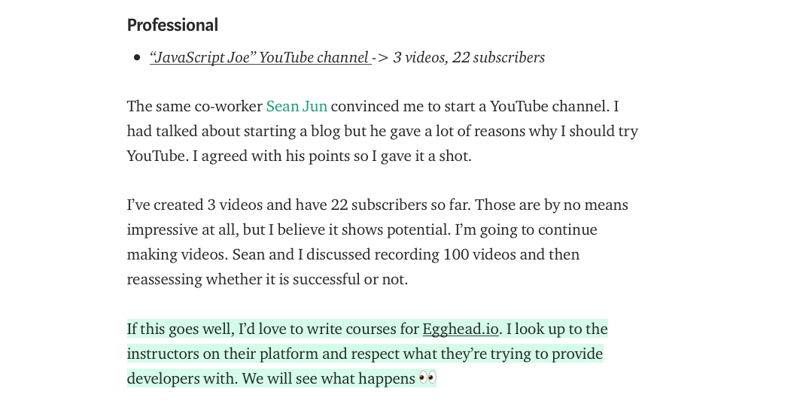
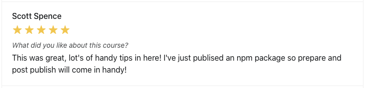
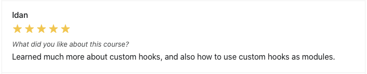

Joe has always been drawn to teaching, having studied education and foreign languages in college with the goal of becoming a language teacher. He decided to get into web development instead and has actively been creating content, documenting his web development journey from the beginning  and sharing what he learns in projects he's worked on. 

He began recording screencasts and publishing them on YouTube and hoped to eventually become an egghead instructor, which he shared as one of his professional goals in his monthly progress update on his Medium in August 2018. 

One of the YouTube videos he made was about how he built a [Chrome extension](https://chrome.google.com/webstore/detail/timezoner/kfnfgcafkeoflpapeniggnnkcaijgbgk?hl=en-US) to help people coordinate meeting times across timezones. 

That particular video caught the attention of egghead instructor Kent C. Dodds and led to Joe being invited to start to teach on egghead. Joe was pumped to join egghead as an instructor because it gave him a platform and an audience with whom he could share web development content. 

Joe says the challenge he faced when it came to creating screencasts was a bit of analysis paralysis. 

> "**The main obstacle is figuring out what you want to teach and how much to teach?**" he says. "Also figuring out what egghead format you want to teach in. Is this something that's suited for a one off lesson? Should this be a collection? Should I make it into a course?"

# Help with overcoming the analysis paralysis

Joe got started with the How to egghead instructor materials we've put together (including John Lindquist's awesome course on how to [Record Badass Screencasts](https://egghead.io/courses/record-badass-screencasts-for-egghead-io)). We sent him the [egghead audio gear kit](https://howtoegghead.com/instructor/screencasting/audio-equipment/) for him to use and keep, which Joe says eliminated the need to research and make a decision on things like what type of microphone to use.

> "**All of these little decisions you have to make before you actually record your first lesson, they do a really good job of making those for me,"** he says. "They essentially give you the structure and the foundation that you need to get started recording."

We gave him feedback on his demo 30-second lesson, which only needed a few tweaks in presentation. **He was able to publish his first lesson in just two weeks.**

Like a lot of people, Joe sought how to answer the "what should I teach?" question. Joel Hooks helped him find the answer in another question: "have you Googled how to do something today?" Joe says making that mindset shift has allowed him to write and create a lot more. 

> "I've developed a system where whenever I Google something, I write it down in a list," he says. "When I'm ready, I take that topic and write a blog post about it. And then I create an egghead video. Then I tweet the video and the article. **So it's kind of building this pipeline of content and just sharing and teaching people."**

Joe has found the support and advice he receives in the egghead instructor Slack to be helpful in getting over analysis paralysis. In addition to shared instructor channels, each instructor gets a private channel with their coach and a few fellow instructors to give them a space to ask questions, brainstorm ideas for their first lessons and workshops, and share drafts. After he spent some time researching and building out some material for his second course, Joe wanted to validate the direction he was heading in. 

> "Once it felt like a solid idea, I shared it with the egghead support group I have in the private channel. I got some thumbs up and then started the process," he says. "**Everyone in the instructor slack is there supporting you, answering questions.**"

To help Joe design his course to be as helpful as possible for learners, we helped him test the material through doing a live workshop, walking him through the process at each step to make it a success. We provided additional guidance throughout the course-creation process, including several worksheets that helped walk him through how to apply instructional design principles. 

> "I studied education and teaching foreign languages in college, but **going through these worksheets, I feel like I learned so much about what it takes to create this beautiful course that will be effective in terms of what people learn and what they retain**," Joe says. "Those worksheets felt like top level, state-of-the-art instructional design. It's a priceless piece of information that I only obtained through egghead."

# Great learner feedback, a passive income stream, and growing his career as an instructor

In his first 18 months as an instructor, Joe published two courses ([Shareable Custom Hooks in React](https://egghead.io/courses/shareable-custom-hooks-in-react) and [The Beginner's Guide to Figma](https://egghead.io/courses/the-beginner-s-guide-to-figma)) and a total of 35 lessons! The workshop for his course sold 21 seats and a little over $1,000 in tickets. 

Joe's content has been getting fantastic feedback from people. Seeing other people learning and feeling empowered with their new knowledge is one of the top payoffs of teaching for him. 

> "That kind of feedback that you see either through Twitter or through egghead course reviews, like 'Wow, I didn't realize that Figma was a great tool' or 'I didn't realize it was that easy to publish a custom hook package on NPM.' **That makes you feel very excited as an instructor and you say to yourself, 'This is why I'm doing it.'"**

With each of his courses, Joe saw about $1,500 per month in royalties for the first two months after releasing before it naturally dropped down. He has since published more one-off videos and collections, which ends up giving him a few hundred dollars each month in royalties. 

> "I remember reading a while ago about passive income," says Joe. "Kind of this mystical, magical thing. How do you make it happen? Everyone's trying to figure it out. And I feel like egghead has really started with that from the ground up. **The model is so enticing as an instructor. It's great having a little bit of extra money each month to pay for expenses."**

He's also had  opportunities open up specifically because he's an egghead instructor, including a job offer as an instructional designer, offers to speak at conferences, and an ongoing paid technical writing gig. 

> "Being an egghead instructor, it's something you can show that **you have authority, you have credibility in this field,**" he says.

He says that other platforms have approached him about teaching for them, but while some of those offers have been tempting, he chooses to focus the energy and time he has to create screencasts into doing them for egghead because of the high level of support and value we provide instructors and the developer community. 

Beyond providing him a platform for his work, Joe says egghead has helped him grow his career as an instructor in the web development community with advice and mentorship. One conversation with Joel Hooks stands out to him as having been particularly valuable in building his personal brand. 

> "One of the pieces of advice he gave me was sticking to just my name more so than 'JavaScript Joe', which I had been using," he says. "So when I was rebuilding my blog, I decided to go with [joeprevite.com](http://joeprevite.com). I'm thankful that I did that because right now I'm learning Rust."

Joe says he recommends collaborating with egghead to others who want to teach developers because how we handle all the nitty gritty details for instructors and provide everything you possibly need to teach. 

> "They have the platform and the audience. They have the experts, they have the equipment, they have the resources," Joe says. "And they want to see you grow and learn. They treat you like a real person and they listen to your ideas. **They give you what you need to share that knowledge."**