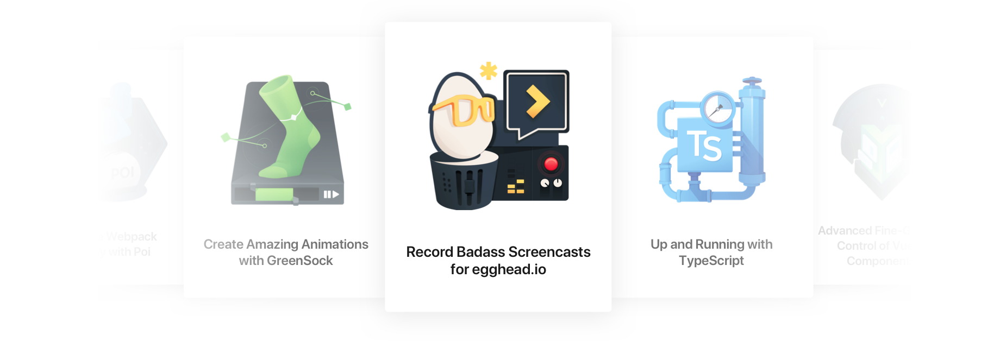
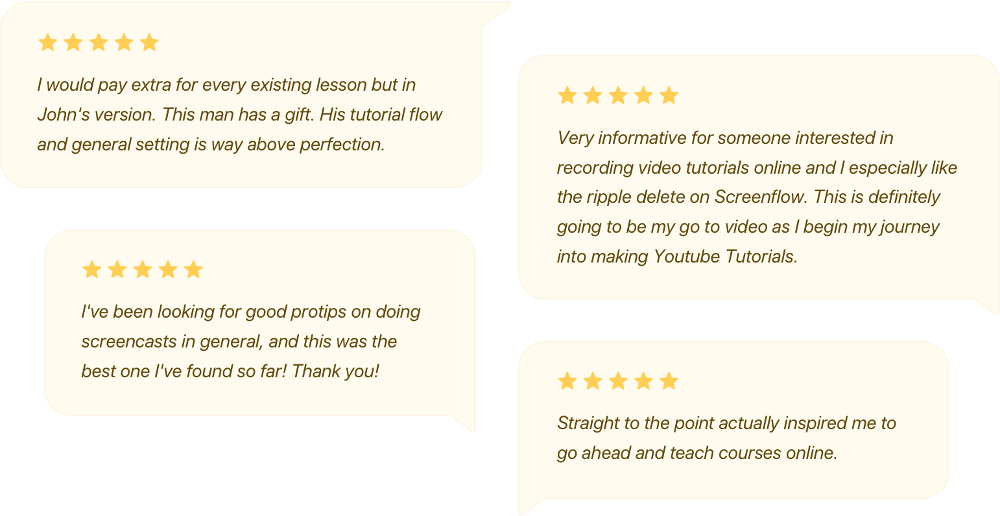

egghead Co-founder and Instructor John Lindquist is the prototypical egghead. He is *the* egghead. 

A master screencaster and developer, John has long been passionate about sharing code and making video tutorials — something he's been doing for over a decade. Taking complex ideas and concepts and simplifying them into smaller, easier to digest pieces for others to learn from has been a primary driver for John. 

> **"The entire programming environment is very complex and all the terminology and concepts around it often come across as super intimidating**," says John. "I want to help people break through the confusion so they can stay excited about creating cool projects."

John spent several years building rich web applications and educational content before making popular AngularJS videos that helped launch the community. He then took a job for a couple years making product videos for JetBrains across a variety of programming languages and tooling.  His videos stood out from other screencasts for developers — they were bite-sized (coming in at just a couple minutes each), focused on single topics, and got straight to the point. 

# The challenge of getting paid to create valuable content

John was creating the video tutorials in his spare time and giving them away for free, accepting donations through the [egghead.io](http://egghead.io) domain that he registered. 

As John's audience continued to grow, he wanted to turn making his own content into something he could do full-time, but there wasn't a clear path available for him to do so. 

> "I heard YouTube was going to allow you to have people subscribe and pay for your channels," says John ."Essentially, **I was waiting for the service to come along where I could just upload demos and then someone would pay me.** That didn't exist."

In 2013, John teamed with Joel Hooks, who was looking to create and sell an online product that would help developers. They discovered an opportunity for collaboration and to be co-founders. John would handle making the screencasts and Joel would handle the rest — from creating the platform to sell the videos, to marketing, to managing accounting and payments, to customer support. 

> "I didn't want to handle building a platform that people would put credit cards into and subscribe to and all the stuff that goes with it," says John. "Joel basically said, 'Here, let me turn this into a product for you.' **He created the service that I was waiting for."**

# Turning screencasting into a full-time dream

The egghead business was built entirely around John's work and style — offering awesome instructors like him a platform to deliver and market valuable, concise video tutorials for developers. 

Although things have evolved as egghead has grown and more instructors have been brought on, John and Joel's original "handshake agreement" is largely how things work today. The egghead team handles the marketing, design, payment disbursement, and so on, while the instructors are able to focus on creating exceptional content. 

> "There are some other successful instructors out there who are not with egghead that doing everything on their own — their own design, marketing, support... all these check boxes that you have to do to build a product," says John. "It's a lot of work that surrounds teaching that can be painful. With egghead, all those checkboxes are taken care of. **All you have to do is teach and the team will handle the rest."**

The breadth and depth of the egghead courses that John has created over the past six years has been astounding. **He's shipped more than 450 lessons.**  

What started as a side-project became a radically life-changing dream come true for John as egghead has grown. In 2014, John had the financial freedom to be able to quit his job as a Technology Evangelist at JetBrains. He can now do what he loves to do full-time on his terms and spend more time with his family. 

> "I told Joel, 'JetBrains is my dream job'. Joel responded, **'Dream bigger!'**" says John. "I love exploring things, making demos and sharing them with others. That's my full-time job now. What more could I ask for?  ****My schedule is my own and we've reached that point where we're happily wealthy. We don't have to worry about when to take vacation or whether I can make it to a family thing.**"**

# Helping others succeed in creating useful, value-packed content

John invented the "egghead style" of teaching — concise, no-fluff, single-concept lessons about modern web development.  

While recording a concise screencast that is just a couple minutes long may seem simple, it's not easy to create high-quality, focused video tutorials that are free from distractions and deliver an awesome and valuable experience for the learner.

> "People come for an answer to a specific question and that's all they really want to hear about," says John. " I think a lot of our instructors, they'll come from speaking at conferences, user groups, or meetups. **There's a lot of transitioning and struggle to create this much more focused kind of content. It can be difficult to understand it's not about what you can include, but what you can leave out. It's a hurdle we try and coach them over."**

### John has affected the lives of hundreds of thousands of people that have been taught or influenced by the content and style of egghead.

He has taught countless people how to execute this very effective style of screencasting. He has helped train and mentor egghead instructors. John and Joel worked together to synthesize John's years of screencasting experience into the **[How to egghead](http://howtoegghead.com)** guide, which is freely available to anyone who wants to learn how to plan and execute badass screencasts. 

Naturally, John created an egghead video course on how to create egghead-style screencasts, which is also available to everyone at no charge as a community resource. 

*Just a small sample of the reviews for John's freely available course on how to record high-quality video lessons for developers.* 

# Lifting others up on their content creation journeys

One of John's favorite parts of this whole journey has been the relationships that have developed as a result, including his friendship with Joel. 

> "Joel has had such a huge positive impact on my life," says John. "We're partners, but it's really been him elevating me the entire time. I truly value our friendship and what we're able to do together."

Another benefit is the incredibly supportive community of instructors that John has helped build. The instructors all help each other with answering questions, coming up with ideas, designing courses, promotion and so on. 

It's all about lifting others up for John, helping them succeed in achieving their goals. He loves seeing instructors breaking free from the bonds of employment and the stresses and deadlines of software development by becoming financially independent through content creation, or using their experience as an egghead instructor as "street cred" to get a job they want. 

> "**For the people who want to be successful content creators and are willing to put in the work, they should be able to be rewarded for their independent motivation and drive,**" says John. 

"We truly want them to succeed and go as far as they want to go with teaching and instructing and creating content. It's really a source of joy to see other people succeed. As is seeing someone proudly putting in their bio that they're an egghead instructor. **What better praise is there than someone showing off that they're part of the product that you had a hand in creating?"**
