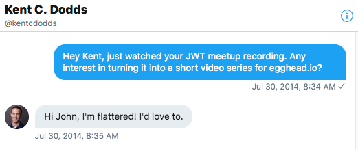
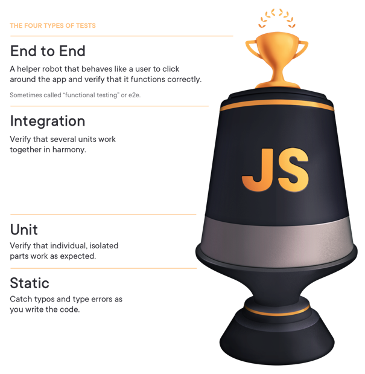
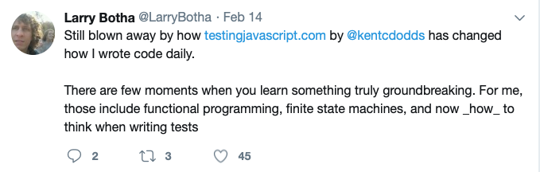
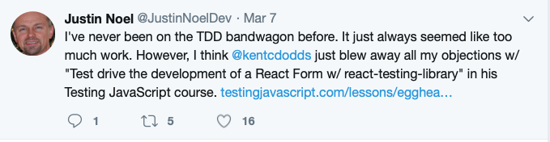

We started working with Kent quite early in his professional career in 2014, shortly after he graduated college. Kent was speaking regularly at meetups when we caught a YouTube video of one of Kent's talks on how to manage authentication with AngularJS applications. It was quite a hot topic at the time we invited him to turn his talk into a course on egghead.io. 

After a bit of coaching on how to produce value-packed content that gets straight to the point, Kent released his first course. It certainly didn't take long after his first course launched for Kent to see the benefits, starting with his first royalty check of $2,000. 

> "With that first check, I was blown away at how much of an impact that this side hustle was going to go have on my life," says Kent. "Becoming egghead instructor also gave me credibility. **It opened new opportunities** for me because conferences were really interested in what I had to say."

# Finding time for creating content on the side as a husband, father & full-time employee

Kent really takes joy in creating content and teaching others — and does it ever show! Over the last five years, Kent has created a ton of content — and not just the more than 200 video lessons he's created on [egghead.io](http://egghead.io). 

While working full-time at PayPal as a JavaScript Engineer, Kent delivered courses on more than one platform, as well as workshops, blog posts, and meetup and conference talks. He has often recycled and reworked the material that he delivered in one format to another. He'd take a workshop he developed for PayPal employees and turn it into a course or take a blog post, turn it into a talk and then turn that into a course — or vice versa. 

**Like many of egghead's instructors, the big challenge for Kent was finding the time to create courses on the side**. As a married father of four children with a full-time job as a developer, time was certainly precious. 

> "Finding time for this side hustle while having those responsibilities has always been a challenge," says Kent. "It takes time to produce material and record it. Even when I already have the material, you have to take the time to cater it to work as recorded material."

 

To make things as easy as possible for instructors, egghead handles all the administrative details of publishing the lessons, maintaining the platform, marketing and selling the courses, collecting payments, and managing customer support.

> "egghead recognizes what you're really good at and they cover all of the other things," says Kent "**You can take the limited time that you have and push it toward that thing you're really good at."**

We have collaborated with Kent for five years now to help grow not only his egghead royalties, but also his following and personal brand, while allowing him to focus exclusively on teaching and delivering high-quality content. In addition to a collaborator, the egghead team has worked as an agent, virtual assistant and fiduciary for Kent. 

# Taking knowledge sharing to the next level with egghead support

As Kent continued his work, he developed opinions and ideas around testing. After having done a lot of work on the topic and delivering several workshops, Kent pitched several courses on testing for egghead. 

At the same time, we'd been thinking on how to help ambitious instructors like Kent that we'd been working with over the years to take their knowledge sharing to the next level. **We developed the idea to use egghead infrastructure as a platform and design agency to release badass extended, deep-dive standalone courses that deliver an insane amount of value for learners and deliver even bigger returns for the creator.** 

Kent is one of egghead's top instructors and we've built a rock-solid relationship with him over the years. Plus, it was clear the testing courses he was developing would deliver such a huge amount of value. So it was a perfect opportunity to help him build this as a standalone product on its own microsite. 

For six months, Kent worked with the support of the egghead team to develop [TestingJavaScript.com](http://testingjavascript.com) in order to help developers learn how to ship applications with confidence.

The main challenge for Kent was, of course, finding time to create the product on top of his work and family responsibilities. 

> "I knew that this was going to be significant because I'd never done seven course modules all in a row before," says Kent. "But it was very clear to me that this would provide a great deal of value to the world. **And it would be really good use of the limited time that I do have on the side.**"

To free up Kent's time to focus exclusively on the content development, we handled everything else. This included designing and building the platform, paying for the hosting, handling customer support, building his website and blog, collecting payments and reimbursements, doing marketing, and even editing the videos. 

> "Testing JavaScript would not have happened if it weren't for egghead support," says Kent. "I had so little time and there was so much to be done that we just chopped out all of the things that I wasn't good at, that I was slower at, or that could be done by someone else. **I'm much happier for it because I don't want to deal with the complexities of a business**. I just focused all my time and attention on creating the content and they took care of everything else."

# A raging success — helping thousands of developers while securing the financial freedom to teach full-time

Kent launched Testing JavaScript in October 2018. It's a detailed and value-packed 5-hour workshop that takes developers from the core fundamentals of testing JavaScript apps all the way through rock-solid, production-ready test strategies using the framework of their choice. 

Kent absolutely nailed his first standalone product launch — **it's the best resource out there to learn how to ship applications with confidence —** and its wild success has blown away everyone's already high expectations. 

In its first year since launching, Testing JavaScript has **sold more than 10,000 licenses.** Kent has provided tons of value to thousands and thousands of people in helping them feel confident with shipping their code with the right kind of testing. 

*Here are just a few of the many, many  messages Kent has received about the value Testing JavaScript provides.* 

Kent has seen huge financial success from Testing JavaScript. It's brought in hundreds of thousands of dollars for him in the first year since its release. 

> "**Just in the first few weeks after launching, I had made about double my salary from Testing JavaScript,**" says Kent. "I'm continuing to do super crazy well financially from it. My egghead royalties were paying my monthly mortgage payment for several years, but Testing JavaScript has made me enough to pay the whole mortgage."

### **Between Testing JavaScript and his** [egghead.io](http://egghead.io/) **courses, Kent has earned into the high six-figures through egghead royalty income.**

Just a couple short months after launching Testing JavaScript, Kent had the **financial freedom to quit his day job as a PayPal developer to focus entirely on his teaching work.** 

> "I went full-time educator back in February because I was like, **'oh, I don't need my salary anymore,**'" says Kent.

"And so I can just dedicate this time to do the things that I want to. And I really wouldn't have done that if it weren't for egghead and Joel. Without egghead's support, becoming a full-time educator would involve a lot more administrative/business type things that I don't want to do. egghead handles everything, **enabling me to just focus on teaching and enjoy it."**

# Investing time in continually helping others & working on the next big thing

One of egghead's core philosophies is to be as aggressively free as possible. Kent completely embraces this philosophy of serving the community. **He is tirelessly helpful, lifting other people up and providing a ton of tools and materials for free.** We are always amazed at both the quality and quantity of his contribution. 

> "**I'm able to spend multiple weeks doing things that are not contributing to the bottom line,"** says Kent. "A lot of time producing free content and making open source tools that people find useful. I spend a silly amount of time on Twitter answering people's questions. I also have spent a lot of time this year updating the Testing JavaScript material. I don't feel like I have to require people to pay extra. I can just say, 'Here's an updated version of all the stuff that you bought last year.'"

Kent has found that the revenue he earns from Testing JavaScript provides him the financial stability to be more ambitious with his goals and the types of projects that he does.  

> "Because **I don't have to deliver something that makes me enough money every single month, I can work on producing something else that hopefully can help as many people and give me the next wave,"** says Kent. "I'm really excited about what else we have coming up."

# "If I was starting all over from the beginning and I had all the time in the world, I would absolutely still choose egghead ..."

We've built a trust-based and mutually beneficial relationship with Kent over the past five years to help him deliver amazing high-quality learning content to help developers and help Kent build up his reputation to a renowned expert. We're continuing to work together to brainstorm ideas for new content and audience-building ideas. 

> "**I'm able to make the biggest impact for my time with egghead**," says Kent. **"**I absolutely recommend egghead for anybody who wants to teach and reach a wide audience of people. You can go to Udemy, Pluralsight, egghead, Frontend Masters or you can build your own thing. If I was starting all over from the beginning and I had all the time in the world, I would absolutely still choose egghead."

