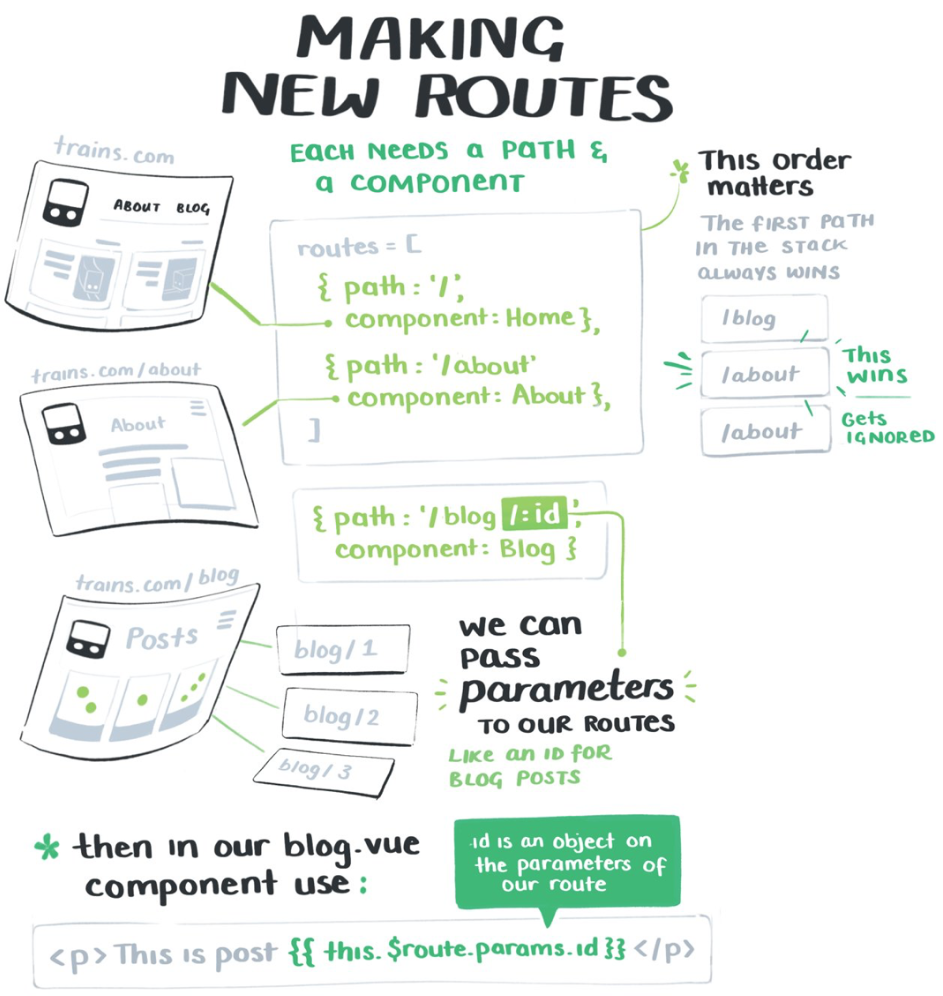
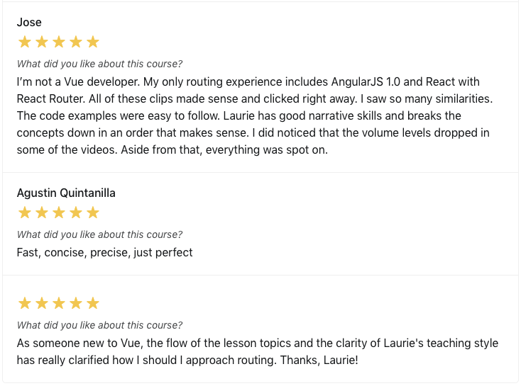

It's pretty hard to find a time when Laurie isn't teaching others. In addition to her job as a Software Engineer on the Learning Team at Gatsby, she shares her knowledge by regularly [speaking at conferences](https://laurieontech.com/speaking/), [writing blog posts](https://laurieontech.com/blog/), facilitating a Girls Who Code club, hanging out in the audience of livestreams, and [guesting on podcasts](https://laurieontech.com/podcasts/).

While she was creating plenty of content, she was unsure about how to more effectively share and market it to reach more people. When we approached her about teaching on egghead, she was excited, but was concerned about how time-consuming it would be, fearing it would be too much on top of her already very full plate.

> "**Between speaking and blogging and facilitating, plus I have a full time job and a life — it's a lot,"** she says.

# Getting started with a few one-off lessons, working up to a full course release

Laurie got started with some one-off lessons, with many of them as video demonstrations of code snippets that were already in blog posts she had written. We helped her get her lessons ready for publishing.

Laurie quickly grasped the egghead lesson style and developed a personal workflow for herself where she can more quickly record & release a lesson.

> "Once you have the setup, once you are more comfortable with the editing tools, **it gets a lot faster**. I can do probably two to three videos in under an hour now."

After publishing [several lessons](https://egghead.io/instructors/laurie-barth) — including a couple of collections — Laurie began work on her first workshop and course: showing people how to use Vue Router.

We met with Laurie to establish the scope by breaking down the main goal of the course and the key takeaways, then worked backwards to the individual lessons she would cover. She prepped her material, complete with code examples, to deliver through a live workshop.

Doing a live workshop gave Laurie a chance to road test the material and reveal what additional questions learners had that she might want to address in the course.

Laurie took all the feedback and learnings from the workshops to create the final recorded lessons for the course, which we worked with her to refine even further to deliver the best experience possible for learners.

> "One of the things that I really love is when I do something in a video that's not quite right, or the best way to do it, I get a video back of how to fix it," says Laurie. "They're really great about being patient with you and helping you figure out logistically what's the best way of teaching what you know."

We handled creating all the supplemental materials for the course to enhance the learning experience — including transcripts, cheat sheets and sketch notes.

_Part of the sketch notes by Maggie Appleton_

# First course launched: A Journey with Vue-Router

Laurie put together a truly excellent course, which launched in mid-December 2019, showing developers how to use Vue's powerful library for routing.

In 10 quick lessons, she covers what you need to get started with vue-router, taking learners through router installation, building and defining routes, accessing information on webpages, through to making the set up scalable and maintainable for larger applications.

Within even just the first week after the launch, the course was already being warmly welcomed by learners, especially people that haven't had much Vue experience.

# 📈 Leveling up skills & making a measurable impact for more people

Laurie's found the collaboration with egghead has leveled up her skills in screencasting as well as coding in front of an audience.

> "I've joked that it's so much harder to do the live workshop than it is to do the recorded lessons because I can't mess up," she says. "It's interesting and challenging. **It makes me much better and much more comfortable at live coding conference talks**, because I'm used to things like typing at speed and not making typos."

Publishing through the egghead platform has also widened Laurie's audience reach. She loves seeing the measurable impact she's having on other people's lives through her videos, saying it blows her mind when she sees the graph of how many minutes that people have watched them.

> "Most of my videos are less than two minutes, and yet in the given month, 5,000 minutes of my videos are watched," Laurie says. "And so you're sitting there and you're thinking **2,500 people I've never met, who have probably never met me, are finding value from this**. This is helping them solve a problem, this is teaching them how to do something that has been bothering them or they needed to do for work or for school or whatever. And that's really worth it."

Not only does publishing with the egghead platform allow her to reach more people, she's finding that teaching through screencasts allows her to supplement her written tutorials and provide another platform to help people become better developers. Different people learn different ways and while some might get value out of a blog post explaining a code snippet, she says others find it more useful to watch her walk through each line of code in her egghead videos.

One of the additional benefits of collaborating with egghead that Laurie appreciates has been being part of the community of 150+ egghead instructors.

> "I love talking with the other instructors," she says. "There have also been egghead instructors who've had conversations with me when I had questions or I needed to learn something and they've taken that time. I'm really grateful for that."

# "You learn things better when you have to teach them."

Laurie enthusiastically recommends becoming an egghead instructor to others, but also advocates for people to teach and learn more in general. Not only does it help others accomplish something more quickly, but it also benefits the person doing the teaching.

> "You learn things better when you have to teach them," she says. "**If I go in with the mindset that I'm going to have to teach people something, I tend to learn it a level deeper and understand it even better than I would otherwise.** It requires you to have a stronger understanding, because in the back of your head you're always thinking about how you can explain it to the next person."
