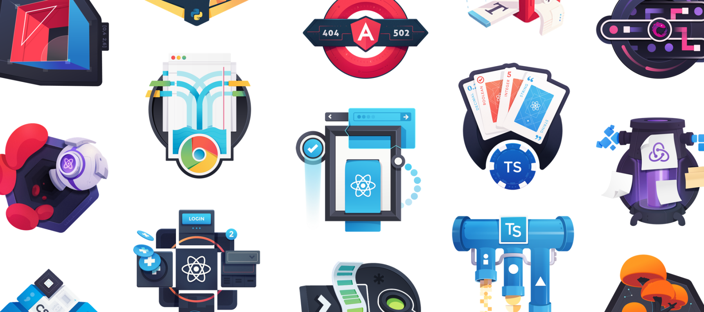
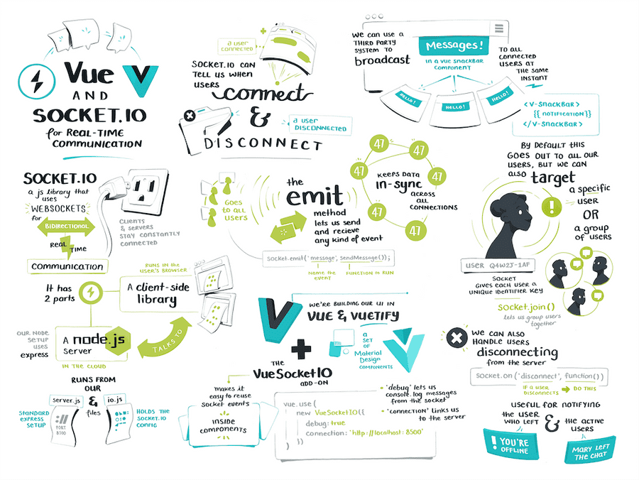

Maggie is a cornerstone of egghead and our efforts. She might be best known for the superb course illustrations and illustrated notes. Over the last couple years, she has expanded her role more into art direction, teaching others how to explain ideas visually, and incorporating anthropology (in which she has a degree) into the work we do. 

Our collaboration with Maggie started back in 2015 when we invited her to make illustrations for egghead courses (she was already doing excellent work as an illustrator and visual designer and publishing illustrations for her JavaScript studies that she did on the side). She soon came on as one of the early full-time team members. Maggie recalls that the way we work took some getting used to in the first few months. 

> "There's no manager, there's no one breathing down your neck," she says. "They basically said, 'Here's some of the work to do. You can do it on whatever time you want.' I don't think I met any of them in person until six months in. So when I first joined, I was a bit like, 'Is this company real?'"

After about six months or so, Maggie says she started settling in and getting more of the vibe of things and has learned a lot and grown her role in the years since. 

## Using visual metaphors to explain egghead course content

For the first few years with egghead, Maggie largely focused on creating unique cover illustrations that capture a course's main concept through a visual metaphor. The illustrations not only help give a concrete idea of what the course is about, but also delight learners and give them a bit of an emotional buy-in to the course. (Instructors love them too — many of them say getting one of these illustrations is a benefit of making an egghead course.) 

*A small sample of Maggie's many excellent illustrations.* 

There's a lot of research that goes into first getting an understanding of a course topic and then creating an accurate metaphor that can be grasped. 

> "People assume I just come up with them off the top of my head," she says. "They think I just sit there and go, 'Oh, here's a great metaphor.'  No, there's a lot of structured systems in place."

Maggie's approach is very much rooted in her expertise in cultural anthropology. After reviewing the course content, her process involves what is essentially field research — searching across online gathering places for developers (e.g. Reddit, Twitter, Hacker News) for keywords used in the course. She'll find other terms used in correlation with those keywords using linguistic tools that scrape the Internet to find and analyze them, which allows her to uncover patterns. The process provides a cultural mapping of the concepts which leads to the initial ideas for visual metaphors to riff on. 

> "So for courses like State Management with Typescript, we're going to start with state management, which is when things change over time," Maggie says. 

"When people use the words time and change, what are they using around them? Usually one of those terms will have some sort of visual association symbols that you can pull from."

After collecting several visual symbols, the sketching process starts to help flesh out what visuals most effectively communicate the concept before narrowing in on one that works and doing more of the design work to make it visually appealing and compelling. 

(You can see an excellent breakdown of Maggie's process with illustrations along the way  [on the egghead community forum](https://community.egghead.io/t/behind-the-scenes-on-an-egghead-illustration/1830).)

Maggie later moved into doing illustrated course notes as a way to help people better understand  the course material. These illustrated notes give people a more thorough visual explanation of the core course concepts — going much deeper into the material and helping to break it down. 

*Maggie's excellent illustrated notes for Vue and [Socket.io](http://socket.io/) for Real-Time Communication.* 

## Scaling it up and exploring new areas

Maggie is truly masterful at creating illustrations and illustrated notes for the courses, but there's only so much she can do as one person and she wanted to take on new and interesting challenges. 

> "It's not interesting for me to just be the only person illustrating and explaining programming concepts, and I do not have the bandwidth to explain all the things that need to be explained," says Maggie. 

"I'm thinking much more on how do we scale this? How do I just give people the tools and techniques to do it themselves? If this is such a desperate need and everyone loves these so much, let's scale it up."

Maggie has brought in other illustrators to handle most of the course illustrations with her providing art direction to keep things consistent. She's also running workshops to help bring the instructors in on the visual thinking process and training learner advocates on how to do illustrated notes. 

> "We'll get on a basic drawing app and help them map out different parts of the system, even if it's just boxes and arrows and labels on things," says Maggie. "We later can refine those into more complex, more refined, more communicative illustrations. But the base is still there. 'Here's our nouns and verbs. Here are things that go into other things. This thing is connected to this.'"

<TwitterTweetEmbed
  tweetId={'1272915301294800896'}
  options={{conversation: 'none', align: 'center'}}
/>

This more collaborative approach pairs the instructor's expertise with Maggie's superb visual thinking skills and levels up the resulting illustrated notes to catch more of the nuances of the content and go deeper than before, while being as easy to follow and visually compelling as ever. 

Beyond this, Maggie is a key partner in growing the business and diving much more deeply into UX and interaction design work at egghead. She's also finding she's drawing even more on her anthropology background into the work, specifically digital anthropology, which was her specialization for her bachelor's degree (and soon to be her focus for her Master's).

> "It's studying how we understand machines and technology through a cultural lens – looking at how our digital tools shape our societies and belief systems," she says. "It's the culture of what we think the word data means, what do we think software is, what do we think programming is. Stuff I shelved when 22-year-old me thought that I was not going to get job as a digital anthropologist. Now it's like 'oh wait, this is all relevant.'"

## The opportunity to grow and explore

Maggie says a key part being part of the egghead team is the total ownership people have over their work in what is genuinely a flat structure, where everyone is a free agent and no one tells you what to do. While she says it takes a while to adapt to this way of working, it's what she would say is a key benefit of the work and she's grown a lot more because of it. 

> "You both have total freedom and total responsibility," Maggie says. "You are in charge of deciding what you think is best to contribute as part of the team. Anyone is pretty much allowed to do anything, whether it fits their job title or not, as long as they have the skills and they're willing to invest a lot of time in learning to do something new. There is no gatekeeping of roles. 'Hey, you want to start getting involved in organizing the business? Hey, you want to decide you want to be an anthropologist in this organization? Go for it!"