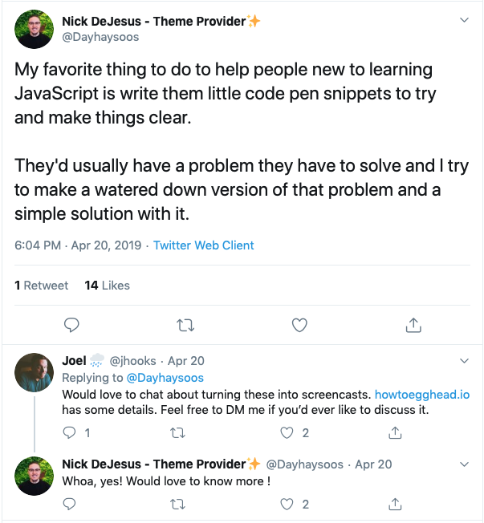
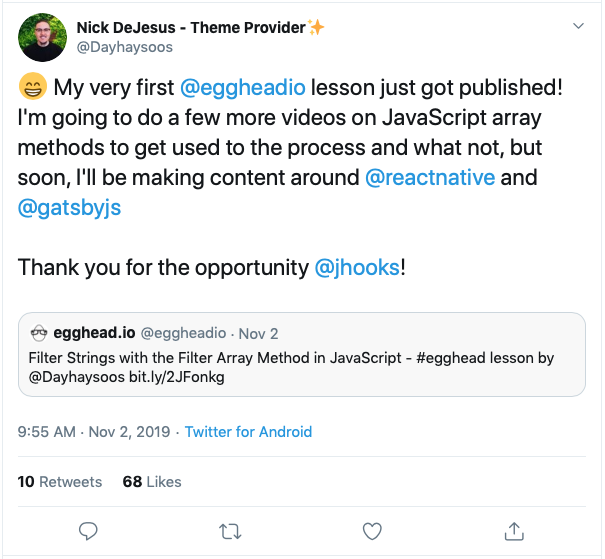

When we reached out to Nick about teaching on egghead, he had never considered teaching through video. 

Nick is an experienced teacher who works with newcomers to the industry through [Resilient Coders](http://www.resilientcoders.org) —  an incredible organization in Boston that runs bootcamps for people of color to train them for high-growth careers as software engineers and connect them with jobs. He's driven to help others avoid some of the difficulties that he faced when he was teaching himself to code without access to mentors or instructors. 

> "**I don't want anyone else to spend two years flailing their arms trying to figure out what to learn, how to learn it, what can they do with the stuff that they learned**," says Nick. "When someone tells me that they're learning how to code on their own, I naturally just want to let them know, 'Hey, hit me up! Let me at least give you some direction that I wish I had when I started.'"

When Nick shared his delight on Twitter about how he helped student learn a Javascript method by sharing a code pen for them to play with, we reached out to see if he'd be interested in  sharing these types of examples through lessons on egghead. 

Although Nick was excited at the prospect of sharing his knowledge on the egghead platform, he did have some hesitation around working with a video format. He had actively stayed away from video courses in his own learning, since he found watching most video courses to be a frustrating waste of time with how bloated and meandering the content was. 

> "**I just didn't imagine myself being like a video person at all,**" says Nick. "I didn't find them effective."

## Learning how to create a high quality screencast that provides a great experience for the learner

To start learning how to create effective and value-packed screencasts, Nick watched one of the courses on egghead and went through John Lindquist's course on how to [Record Badass Screencasts](https://egghead.io/courses/record-badass-screencasts-for-egghead-io). 

> "It blew my mind," says Nick. **"The biggest things I took away were getting out of the way of the viewer and just making sure to get straight to the content, being very specific**. It started changing the way I look at how I should produce my own content or how I should communicate when I want to teach."

Since he already had plenty of experience going over the fundamentals of JavaScript with his students, Nick chose to demonstrate one of the basic JavaScript methods for his first lesson. 

We reviewed Nick's recordings and provided specific tips on how he should lead the eyes to certain parts of the screen or cut some unnecessary sentences in order to stay on point. Zac Jones, who helps egghead instructors get their content published, went over the feedback with Nick and discussed how he could apply it to the next iteration of the lesson. 

Nick was always very receptive to the feedback and appreciated being held to the high standards that set egghead video lessons apart from others. 

> "There are videos that I thought 'man, I just killed this after like 20 takes'," he says. "And I would send it and Zac would point out these little things. **It sounds nitpicky, but when you consider the feedback, it actually makes the process of making good content even easier.** They're also very encouraging and really good at keeping everything positive."

In addition to support from egghead staff, Nick says the amazing community of supportive egghead instructors helps him stay motivated to share what he learns and to become an even better instructor. 

## 🎉 Shipping that first lesson: "I imagine it's like that same feeling you get when you get your first karate belt"

After incorporating all the feedback and refining his lesson, Nick published his first lesson on egghead! 

The [lesson is a very quick breakdown of how the filter array method works in JavaScript](https://egghead.io/lessons/javascript-filter-strings-with-the-filter-array-method-in-javascript) by showing how to write a function that takes in a string and applies filter to the array. Nick was very proud to hit the milestone of getting his first lesson published (as he should be!) 

> "**I imagine it's like that same feeling you get when you get your first karate belt,"** he says. "It's an accomplishment. I really admire the way the videos are done and I'm being held to that same standard. **To know that I can deliver content at that standard, that just feels really good."**

Going through this process has also been a huge perspective shift for Nick, influencing not only his continuing work on screencasts for egghead, but also his conversations and teaching in his day-to-day work at Resilient Coders. He'll often see a bootcamper get stressed and worry about everything they need to do when they're working on a project such as building a full-stack app. 

> "I remember how egghead videos go straight to the point," he says. "I tell them, 'You're thinking way too far ahead. **Let's talk specifically about what your very next step is.'** And as soon as I started speaking like this, they start feeling more calm, they start feeling more confident, they start making progress, they start getting things done."

## Just the beginning...

With his first lesson published, we're now working with Nick on his next steps including creating workshops. Nick plans to ship more lessons on Javascript fundamentals as well as to create more content on React Native and Gatsby. 

The prospect of building up a catalog of lessons to share his perspective and what he's learned with the community and to help even more people is exciting for Nick. 

> **"What I'm looking forward to is putting out enough content to the point where people are reaching out to me about it, asking me questions, telling me that they learned a lot,"** says Nick. "That's a really good feeling I get a lot. You know, someone saying 'Hey, Nick taught me how to do this!'"
