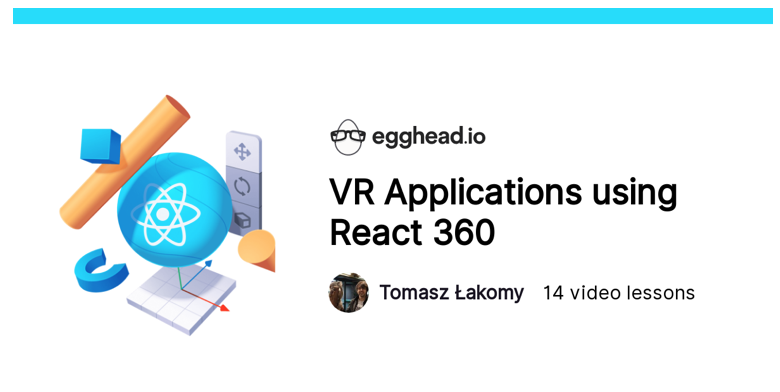
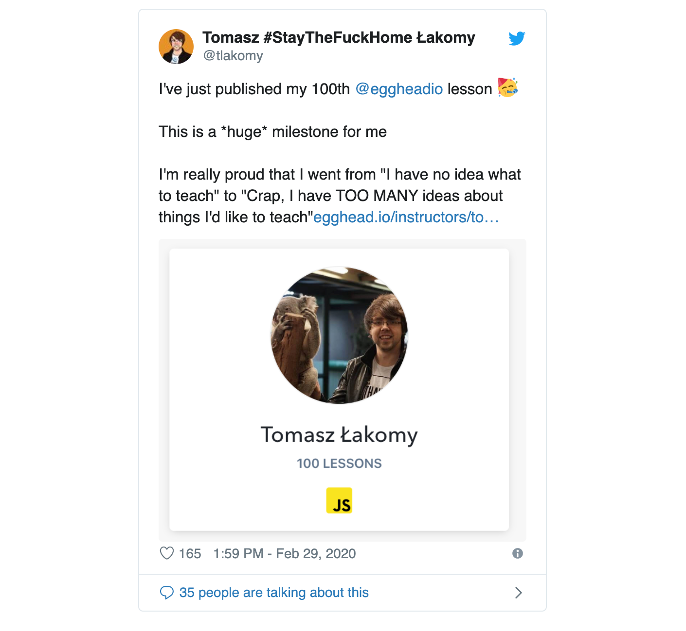

Tomasz's journey with egghead began as a learner. When he had to quickly learn about React and Webpack for a new job opportunity in 2016, he bought an egghead subscription. He actually credits getting that job to what he was able to learn in a short amount of time and has continued to level up his knowledge ever since through egghead lessons.  

A couple years later in 2018, and with some public speaking experience under his belt, he jumped at the opportunity to give back to the egghead community as an instructor. Although thrilled at the opportunity, Tomasz was worried about what he would teach. 

> "Even though I had been a speaker at tech conferences and had experience explaining things to others, **I had this feeling at the very beginning that I have nothing to teach — which is not true at all**," he says. "If you have a nontrivial amount of experience as a developer, you definitely have something to teach."

One thing Tomasz lacked experience with was teaching through video lessons; he hadn't done any screencasting prior to joining egghead as an instructor. 

# Getting comfortable with the screencasting process and adapting to a whole new medium

Tomasz began with the comprehensive and easy-to-follow egghead materials to learn how to do a video lesson (including John Lindquist's course on how to [Record Badass Screencasts)](https://egghead.io/courses/record-badass-screencasts-for-egghead-io), followed by creating his first 30-second demo to get feedback from the egghead team. Tomasz says without having the support and guidance right from the get go, it would have been difficult to get started. 

Tomasz was blown away at just how difficult it was to record a screencast — even just a short 30-second demo. He found it much easier to give a 30-minute conference talk in front of 500 people than to screencast a short lesson and had to learn to adapt to this new medium. 

> "At a conference, I get a single shot with people, so I prefer to explain something twice," says Tomasz. "In the beginning of creating lessons for egghead, I ended up repeating myself. They told me that this is not really necessary. There's the rewind button, there's the description, the code example. There's a lot of context to help developers learn at their own pace."

After a bit of guidance and practice on how to improve his lessons to better explain concepts, Tomasz quickly picked up screencasting and the egghead style. He started with a couple stand-alone lessons, followed by a few connected lessons in a playlist before publishing [a full course on building VR applications using React 360](https://egghead.io/courses/vr-applications-using-react-360). 

Even as he's become a pro at screencasting, Tomasz has found having that ongoing access to feedback super helpful. As he builds his new course about AWS, Tomasz has been going through the [egghead workshop production](https://howtoegghead.com/instructor/workshops/) process, giving him the opportunity to test and refine the course material he's planning to cover, with early feedback from both a member of the egghead team and from leaners with a live workshop. 

> "**I basically get to do part of my course in public**," he says. "What kinds of things are not clear for the folks who will hopefully end up watching the course? What kinds of pain points are they experiencing? It's a way to get those things addressed very quickly."

# Sharing what he learns, as he learns it

Tomasz takes the "learn in public" mantra to heart. The lessons he creates are often on subjects he's been recently learning rather than subjects he has years of experience in. ****When he passed an AWS Certification test, for example, he recorded a few collections with dozens of lessons on the topics he learned about. He finds teaching something shortly after learning it actually results in more helpful content for others looking to learn. 

> "I wouldn't want to create a course about learning JavaScript from scratch, for example, because I've been doing JavaScript for close to eight years," Tomasz says. "Some of the things are obvious to me that are not so obvious for beginners. **When I've learned something new, it is still fresh. You identify with those common pain points for beginners that other people are going to stumble upon."**

Not only can the content end up being more useful for learners, Tomasz says teaching is an incredible way of ensuring that he really understands the subject in question.

> "I like to say that most of the lessons I've recorded on egghead were not for others, they were for me," he says. **"I was learning something new and I just wanted to solidify the knowledge by recording material for egghead, while also sharing it with the community."**

# Reaching people around the world from his apartment with an impressive stack of lessons

Tomasz has been creating lessons at an incredible rate. In just 16 months, he hit an impressive milestone: publishing 100 lessons! 

He continues to put out more every month on a wide range of topics and has a second full course in the works. It's a big accomplishment to publish so much, especially considering a lesson typically takes about two hours to create from scratch. 

> "egghead is this huge opportunity and I didn't want to waste it," he says. "I'm using it all I can and working quite hard to put out a lot of content."

All that hard work is paying off for Tomasz. He says he's seen great opportunities open up as a result of some of the content he's put out on the egghead platform and the wider audience he's able to reach as a result. 

> "I have DMs from people telling me, 'I've done so much from your lessons. Would you like to be a guest on my podcast or would you like to collaborate with me on this?'" says Tomasz. *"***It's a good thing for me because I'm able to grow my own brand and my own recognition as a software engineer, which is not the easiest thing to do."**

Tomasz has found that his egghead lessons have a staying power that a conference talk doesn't have because it's available more permanently. People can view and benefit from his lessons long after he's created them. 

Putting out content on the egghead platform also creates a nice passive income stream for Tomasz. With all the lessons he's created, Tomasz has a nice and ever-growing additional income stream, which has helped pay for things like his and his wife's honeymoon. 

While there are other platforms he could use to teach others, Tomasz says it's important to him to collaborate with a company that focuses on developers and cares about them — one that is a good fit for the kind of content he wants to create and the community he wants to engage with.

> "With egghead, you get to join this community of amazing human beings," he says. **"You get to grow as an engineer by teaching others. And you get to create content that people will enjoy worldwide while sitting in your own apartment."**