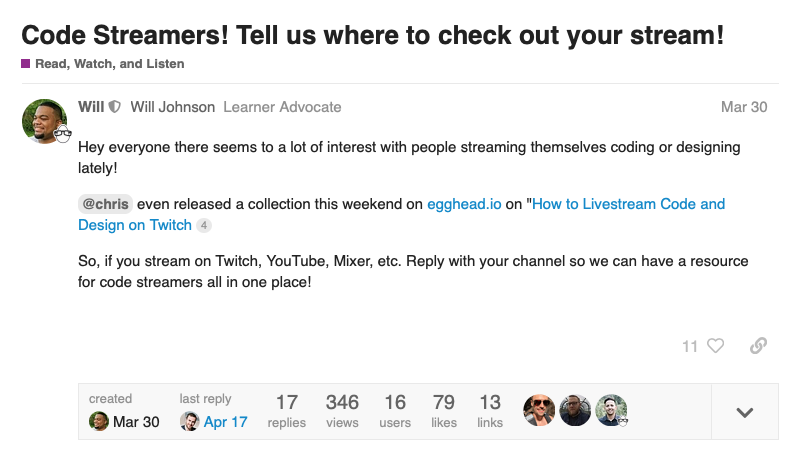

Will is the community engineer at egghead. He's the glue that brings the egghead community together. He works passionately and consistently to facilitate connections between people, help others on their coding journeys, and open up opportunities to show off the cool things they're working on.

> I like to look at it as I come up with ways to help other people shine," says Will.

Even before he came onboard with egghead, Will was consistently contributing in both his local coding community and online — such as answering questions and posting coding tips on Twitter, blogging about what he was learning, and mentoring with the Coder Dojo in Kansas City. Incredibly, he was doing all this at a time that he was working 12-hour shifts at his day job and teaching himself to code on nights and weekends.

We connected with Will in 2019 and later in the year he joined the egghead team to help build the egghead learning community to help instructors and learners connect and share more knowledge with each other.

While he was excited to join the team in what would be his first tech job, he wasn't sure exactly what his day-to-day work would look like, especially given how much freeform control over his work he'd have as an egghead team member.

> "Every single job I've had as an adult has been you follow these strict set of steps, there wasn't very much room to deviate. " says Will. "So initially when I got offered the job, I'm like, 'I'm going to do it but I have no idea how this is going to turn out.'"

# Taking on the challenge of building community and enhancing the experience for learners

Will joined the team when we were in the early stages of launching the [egghead community forum](https://community.egghead.io) and [learner advocacy](https://howtoegghead.com/advocate) program to help people learn better and more deeply and share knowledge with each other.

It's a huge challenge to create a space where people feel safe to learn, ask questions, contribute advice and experiences, and encourage one another in their professional practices.

> "It's the Internet — there's plenty of places for people to hang out," says Will. "Trying to get people to have another place on their list to hang out, it's hard to get people to build a new habit."

Will has met that challenge head on by giving people compelling reasons to participate and regularly share with others in the community. He comes up with and carries out awesome ideas to help people gather together and build new skills — from doing forum AMAs and Twitter chats with instructors, to getting people to share what they've created, to organizing activities like community study sessions and mob programming sessions.

> "That's probably the best part I like about working with egghead — 90% of the times I have an idea, it's like, 'Yeah, let's try it,'" says Will.

"If it's a Twitter chat, the first people who are there are the egghead employees asking questions to get the ball rolling and set the example. Whatever idea I had, they were there to make sure that it wasn't a ghost town and it wasn't just the tumbleweeds rolling by. I think that made more people comfortable as well."

<TwitterTweetEmbed
  tweetId={'1265341941820067846'}
  options={{conversation: 'none', align: 'center'}}
/>
One of the many #eggheadChat opportunities there have been since the first one in November 2019.

One of Will's many, many posts on the egghead community discussion forum community egghead.io

Will has been a driving force for our [learner advocacy program](https://howtoegghead.com/advocate). Learner Advocates are people that learn public and are compensated by egghead to attend and participate in workshops and creating helpful resources to supplement the published courses, making it easier for everyone to learn.

> "We'll take the notes, we'll highlight the most important parts, we'll add any visual little sketches or things that might make things more clear. We'll find the best related conference talk, the best related podcast — all this stuff is in one place so you don't have to spend that time doing it yourself," Will says.

He says part of the job of a learner advocate in the live workshops is to make other participants feel comfortable asking questions and getting involved.

> "You're in a virtual room full of 40 strangers — it's human nature to not want to seem odd or asking a dumb question," he says. "But if there's like three other people in there willingly asking dumb questions, more and more people are going to be willing to ask."

# Energizing the community and making connections, while also growing his career in tech

Will has energized our small community of learner advocates and taken what was just an idea and turned it into a reality that will ultimately expand to our members and the broader web development community.

<TwitterTweetEmbed
  tweetId={'1230215521628495872'}
  options={{conversation: 'none', align: 'center'}}
/>

He has helped shine a spotlight on individual people's work and helped facilitate connections, all while continuing his own coding journey and posting, blogging and tweeting about what he's learning and share his experience with others.

As a husband and the father of six kids, Will especially enjoys the advantage of working on a remote team with a less rigid schedule than his old job, which has meant being able to spend more time with his family. On top of that, Will says one of the top benefits of working as part of the egghead team has been what he's gained through the relationships he's developed others.

> "I'm learning how to program as well, so I'm able to link up with some of the smartest people and be able to ask questions and get help and get feedback," he says.

Some of the relationships he's built with egghead instructors have lead to other opportunities, he says. Things like having Tomasz Łakomy as a guest on the podcast he's started and appearing on Jason Lengstorf's stream have had a domino effect and lead to opportunities such as an offer to write for a company based in Europe and being invited to speak at conferences internationally.

With his work, Will gets to continue to act on his deep passion for helping people on their programming journeys.

> "I just believe that we're all here to help each other," he says. "No one can do anything on their own. The feeling you get when you help someone reach their goal, there's not very many things that can top that."
