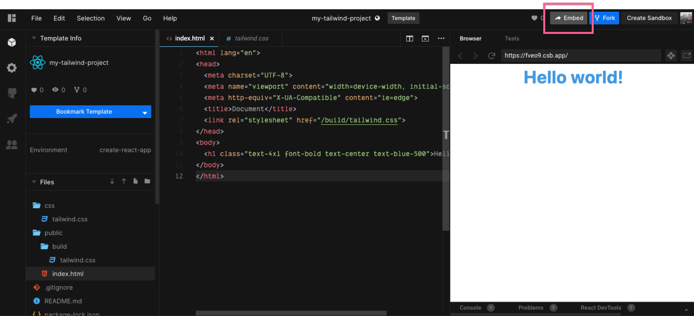
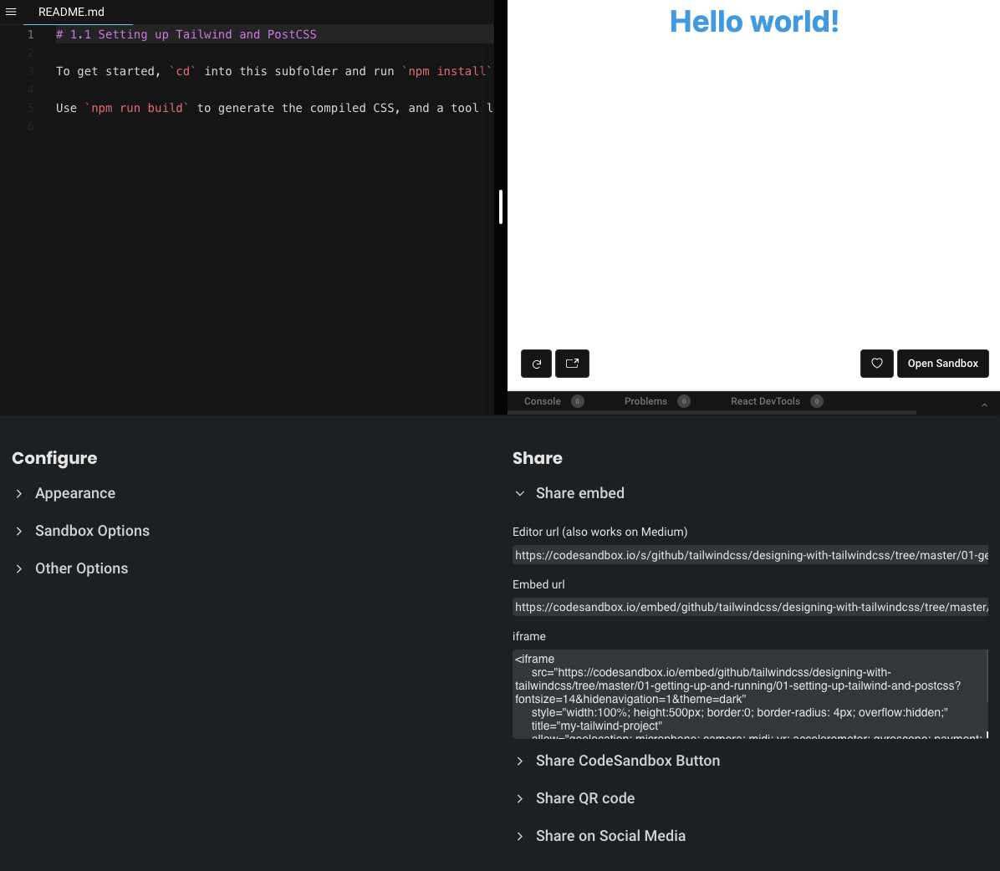
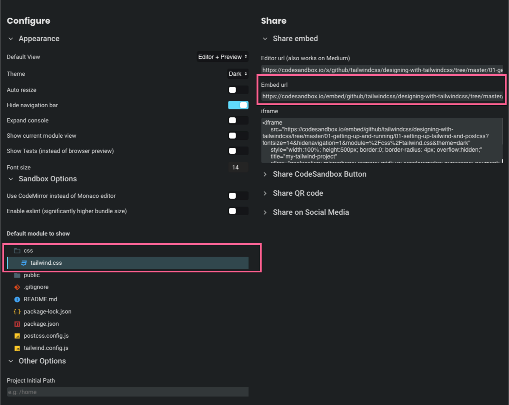

_Have your code in GitHub and want to embed it with codesandbox? [Read this article on how to pull Code on GitHub into CodeSandbox](/instructor/github-to-codesandbox)._

CodeSandbox gives you the ability to share your code in the format that you want with minimal styling as to not crowd out the focus of your example - the code.

When your code is example is ready to go, click the `Embed` button in the nave bar on the top right of the sandbox screen.

When you click this button, it will provide you a dialog with the Preview on the right and show a default file on the left (that can vary).

You'll notice already that the style is much cleaner for sharing. There's no file tree on the side or navbar to distract the learner from what you're trying to demonstrate.

Down at the bottom you'll see that you can configure how the embed loads for users with options like expanding the console, font size, and showing what file will load by default.

There are [quite a few options that you can set which you can explore here.](https://codesandbox.io/docs/embedding#embed-options)

While a lot of the options are up to your preference, the two things that are essential is that **you select the default file you want to show on embed load.** In this example `tailwind.css` is selected and will be shown, this should be the main file you worked on in your lesson.

The **next important step is to copy the `Embed url`** and paste this into the `Lesson Code Embed` form on the edit page of the given lesson.

You'll notice that the url generated in the `Embed url` form will have `/embed/` rather than `/s/` (the default) and will also include any and all options you selected as seen here: 