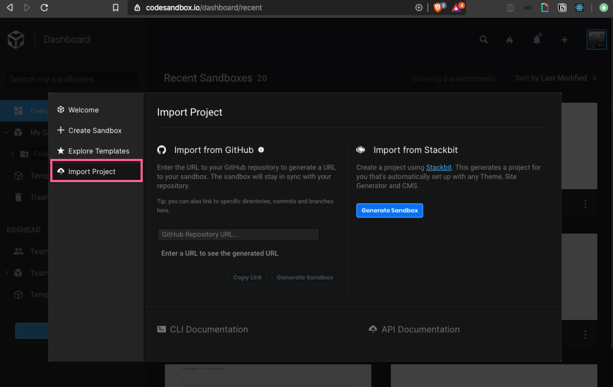
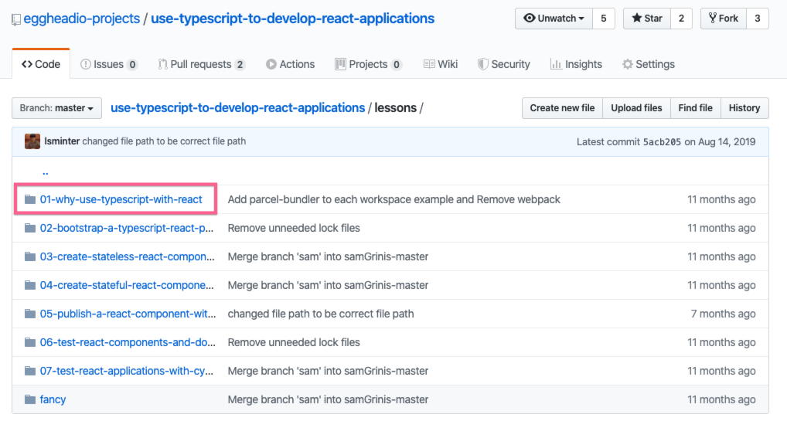

When you are building lesson example, a lot of the time they are going to exist on GitHub. It's easy to maintain and keep track of as you develop your content.

Now it's ready to share and add to you're lesson. The GitHub repository link works but when the code can be run in the browser, a embed works much better as learners won't need to click away from your lesson.

There is no need to re-write your example in CodeSandbox when you can pull it in straight from GitHub. **This will work for any application that follows the generally accepted project format for a given Framework**. e.g. Create React App for React.

When you are on the 'Create' screen, you can click the `Import Project` tab which will give you a form to import code from GitHub.

Paste the link to the application code that you want to import. Note that you can import from a specific folder from GitHub so you can have all your course examples in one repository.

We'll use the first folder in [the repository above](https://github.com/eggheadio-projects/use-typescript-to-develop-react-applications/tree/master/lessons/01-why-use-typescript-with-react).

This generates a codesandbox at the following url:

`https://codesandbox.io/s/github/eggheadio-projects/use-typescript-to-develop-react-applications/tree/master/lessons/01-why-use-typescript-with-react`

This is ready to share! [Make sure to share an embed](/instructor/codesandbox-code-embed).
