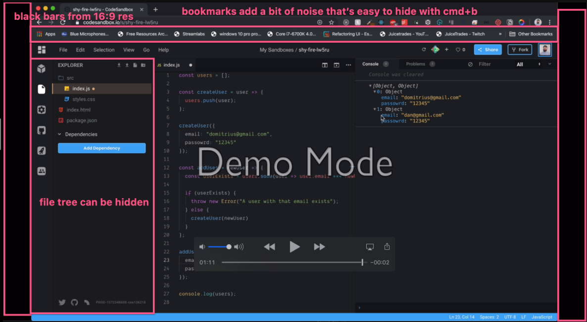

# Key Takeaways

- Start writing code while talking about it, then see if any additional explanation is required
- Remove extra information that would take away from what you're teaching (refer to [Screen Setup Feedback Cycles](/instructor/instructor-feedback-cycles/screen-setup) for more information).

---

This feedback cycle for “show, don’t tell” and removing distractions is [Error handling with the JavaScript Array#some method](https://egghead.io/lessons/egghead-error-handling-with-the-javascript-array-some-method) by Domitrius Clark

## First Take

VIDEO Here ⚠️

Starting off, I love how clear his voice is. He also moves his cursor to “follow the action” across the screen, which is helpful for the learner. But immediately, I can also see that there’s a lot of clutter on the screen from his desktop, browser, bookmark, etc. And there’s a long introduction, where he’s just speaking, rather than showing/doing.

Let’s see what the official first take feedback was!

## First Take Feedback

VIDEO Here ⚠️

- **START-00:19** - This can be cut as it’s an introduction. **Great information but this type of info would be present in the lesson description as it builds context for what you’re about to do**.
- **00:20**- How you start here is what we’re looking for.
- **01:11** - Here is where you would want to give a **walk through/review of what is happening in the data from the function call to the output on the screen.**

**Screen Setup**

- Looks like you are recording in **16:9 resolution (macbook default)** which adds bars on either side of the video. We have a site license we can get you for a tool that manages screen res really wellMore on that here (that [whole article](https://howtoegghead.com/instructor/screencasting/screen-setup/#access-hidpi-mode-on-macos) is really good!).

- **We want to remove as many distractions for the learner as possible as well.** This will also let you bump up the font a little more which is usually a good thing **Hiding bookmarks if possible. Hide file tree when not relevant.**
    - [Here’s a lesson on how to remove distractions](https://egghead.io/lessons/tools-remove-distractions)
    - [Here’s recommended VSCode settings for minimizing distractions](https://howtoegghead.com/instructor/screencasting/vscode/)

## Second Take

VIDEO Here ⚠️

There’s a little less clutter, and the black bands to the sides are gone, but we can probably reduce clutter even more by using a browser as “new user” or incognito mode, and also getting rid of the task bar at the top. 

But he’s getting right to the point, and types while speaking, as well as continuing to use the cursor to navigate the learner’s gaze.