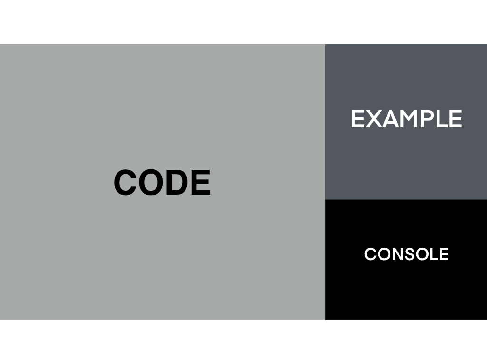
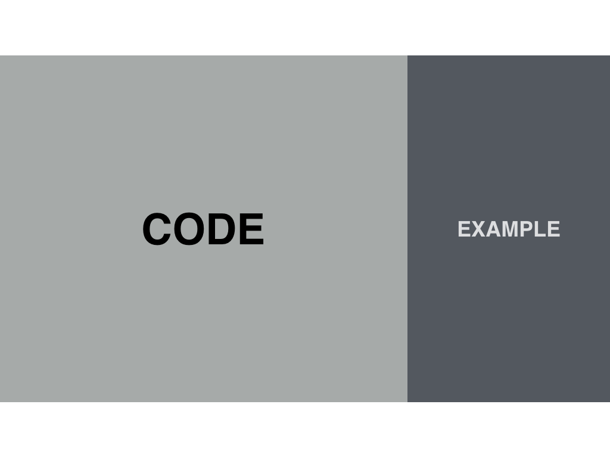

The key to a successful screen setup for screencasting code is to **remove distractions**. Distractions take away from the execution, as your students’ eyes aren’t sure what to focus on. There’s a reason why Apple is so popular with its minimalist designs!

During lessons, we recommend that you hide terminals or file structure if you are done with them to highlight what is currently being discussed. This will allow the current topic to be front and center in both the screencast and your audience’s mind.

## 3-Column Layout

The **3-column layout** is our preferred way of presenting the code editor and browser, with **2:1 ratio of editor to browser**. We also record at **1280x720 pixels** in **HiDPI mode**.

## Show Output in Multiple Ways

Another way to improve your screen setup is to **show output in as many ways as possible**. If there are multiple ways to show a “thing,” let’s show it!

Output can look different depending on the lesson. Often times seeing the console log is enough but there are other tools at your disposal as well:

- Edit styles inline in the elements panel (immediate feedback is 💯)
- Display an expected error in console
- Pop open the Network panel and check request
- ???
- Profit! 😉

## Key Takeaways

We want to present outputs in as many ways as possible, and also remove distractions. Here are some resources that may help you learn more about keeping your screen distraction-free!

- [Prepare your desktop environment for screencasting code](https://howtoegghead.com/instructor/screencasting/screen-setup/)
- [Keep VSCode environment clean](https://howtoegghead.com/instructor/screencasting/vscode/)
- [Set up your Mac terminal for screencasting](https://howtoegghead.com/instructor/screencasting/terminal/)
- [Hide the menu bar (Mac) and taskbar (Windows)](/instructor/screencasting/hide-the-menu-bar-taskbar/)

# Feedback Cycles

We have a few examples of **Feedback Cycles for Screen Setup and Removing Distractions**

<Card href="/instructor/instructor-feedback-cycles/screen-setup/screen-setup" variant="primary">

# 🖥

## Screen Setup

</Card>

<Card href="/instructor/instructor-feedback-cycles/screen-setup/removing-distractions" variant="primary">

# 🗒

## Removing Distractions

</Card>

<Card href="/instructor/instructor-feedback-cycles/screen-setup/screen-and-code-layout" variant="primary">

# 🧩

## Screen and Code Layout

</Card>

<Card href="/instructor/instructor-feedback-cycles/screen-setup/recording-lessons-in-hidpi-mode" variant="primary">

# 📺

## Recording Lessons in HiDPI Mode (1028x720 pixels)

</Card>