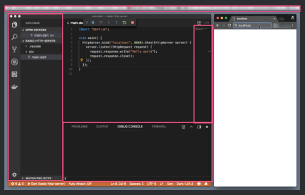
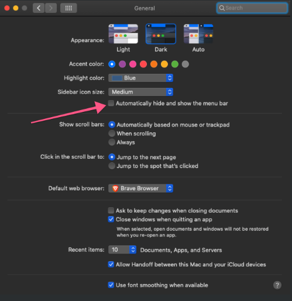
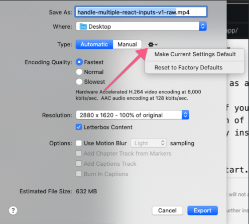

# Key Takeaways

- Record lessons at **1280 x 720 pixels**, in **HiDPI mode**
- Maximize readability and hide/reduce any distractions when possible

---

At egghead, we record our lessons at **1280 pixels x 720 pixels**, in **HiDPI mode**.

If you want to learn more about what HiDPI mode means, and how to set up your desktop to prepare for recording, there are 2 terrific resources:

- [Prepare your desktop environment for screencasting code](https://howtoegghead.com/instructor/screencasting/screen-setup) on howtoegghead.com
- [Prepare to Record - Screen Resolution and Mic Check](https://egghead.io/lessons/tools-prepare-to-record-screen-resolution-and-mic-check) Lesson on egghead.io

In this feedback cycle, we’ll take a look at a lesson that became [Write a Basic HTTP Server in Dart](https://egghead.io/lessons/dart-write-a-basic-http-server-in-dart) by Jermaine Oppong!

## First Take

VIDEO Here ⚠️

Right off the bat, we can see that the instructor gets straight to the point! He utilizes the **2:1 ratio** for **code editor to browser**, which allows us to quickly see the output of his code. He’s even blotted out the taskbar - but as you may know by now, there’s a way to just remove it from view all together! And the tree to the left of the code editor can probably be hidden as well.

The lesson content is concise. The way he typed, spoke, and then showed the output is exactly in the “egghead style.” I’d imagine most of the feedback would be on how to make the code even easier to read by minimizing the small bits of distraction still on the screen.

Let’s see what the official feedback was!

## First Take Feedback

You’re a natural with recording and picked up on the egghead style really well, awesome job. The notes I have on the audition video are **screen structure** related.

**Our goal is to maximize readability and hide/reduce any distractions when possible.**

It looks like you could expand the browser and code windows a bit so they cover to the edges of the screen. The file structure and console can be closed out with the font size of the code and browser output increased. Something in the **16pt-18pt range** generally works well, the bigger the better barring any excessive scrolling.

I see you have the menu-bar blurred out, which works but you can hide it in the mac menu section under “General." (Learn how you can hide the Taskbar on Windows [here](/instructor/screencasting/hide-the-menu-bar-taskbar).

This lesson looks a little blurry, **we recommend 1280x720 HiDPI**. One thing that can fix that is setting screenflow export to 1**00% scaling** since their scaling adds some fuzz.

The little "cog menu" next to "type" in that dialog lets you set it as a default too.

## Second Take

VIDEO Here ⚠️

The 2:1 ratio is gone with the browser window, but the instructor has opted to show the output in the terminal instead. The screen is completely decluttered, and the only information you see is the code he’s writing, and the code he’s outputting.

All this, a skill taught, and in 30 seconds flat! That's what we call egghead efficiency!
