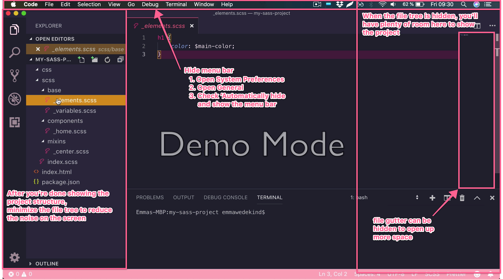
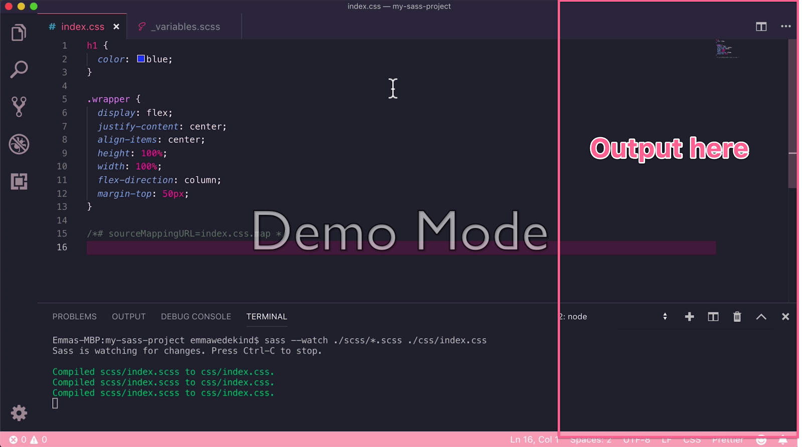

## Key Takeaways

- Optimize for a distraction-free screen setup

---

Let’s take a look at another feedback cycle! This feedback cycle focuses on removing distractions from the screen, which is similar to [Screen Setup](/instructor/instructor-feedback-cycles/screen-setup/screen-setup). This one had three takes before the lesson was published on egghead.

This lesson became [“Converting Sass to CSS”](https://egghead.io/lessons/css-converting-sass-to-css) by [Emma Bostian](https://egghead.io/instructors/emma-bostian)

### First Take

VIDEO Here ⚠️

First thing I notice is that she also has the menu bar, which adds a bit of clutter to the screen. There also seems to be a lot of empty spaces on her VSCode. However, she has just one window open, which helps to make immediately clear what we should be focusing on.

Let’s see what the feedback was for Take 1!

### First Take Feedback

You nailed the egghead style of narrating what you type and showing us what you’re doing.

One big thing that we like to do is **remove any and all distractions from the screen so the viewer won’t get distracted from what you’re teaching**. For the file tree, it’s great that you walk us through that but once you’re done, it’d be good to minimize this to open up more room on the screen. **This lets you increase the font size of the file and terminal.**

It also allows you to have the browser output to the right of VSCode so you don’t have to tab over later.

Here are a few specific notes on the lesson:

**START-00:15** - This is an introduction and can be cut. Let's start with exploring the project structure first. The information works really great in the description of the lesson.

**00:40-00:45** - This can be cut as it’s explaining before doing and becomes redundant as you show us how to run the command.

**01:22**- Highlight the terminal to ‘navigate our eyes’ while you tell us that Sass is now watching files for updates.

**01:45** - While it's super simple, it would still be good to mention that you linked the index.css file that sass transpiles to.

But again, awesome job on this, you’re a natural. Could you do another iteration with that feedback implemented?

### Second Take

VIDEO Here ⚠️

We’re diving right in to the lesson now, having taken the advice to cut out the “introduction.” Efficiency! We might also want to actively type commands to really “show” what we’re doing.

Let’s see what the feedback was for this take!

### Second Take Feedback

**00:30** - It’s still good to show yourself type out the command here. It could be confusing to people that the command is already running when they first see it.

**01:01** - **When showing the change, it's always best to be as specific as possible and highlight key properties/variables so add**: “which is now reflected in our index.css file…” “Here is the h1 color property…”

- [Learn more about Accessible Speech](https://howtoegghead.com/instructor/style-guide/accessible-speech/)

**01:02** - Because you don’t have the index.css linked, this would be a good spot to **split the screen with code on the left and output on the right** to show that the app actually hasn’t updated its styles.

**01:15** - Here it would be good to change the scss again variable again to show that it updates correctly in the browser as well. This might feel super redundant but the repetition really drives home the point - you could even run the npm sass command that you add at the end as well to do that.

### Third Take

VIDEO Here ⚠️

She’s describing what she’s highlighting, and she’s typing in commands! And she’s showing output with split-screen and verbally explaining what’s happening as the code compiles, and she refreshes the browser. Fabulous!
