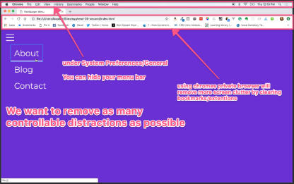
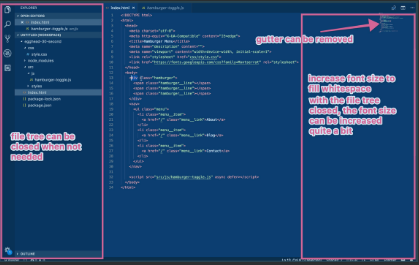

Key Takeaways

- Optimize for a distraction-free screen setup
- Maximize the space available for increasing font-sizes
- Utilize the **3-column layout**: editor taking up 2/3 and a browser on the right side taking up the remaining 1/3 of the screen

---

As we’ve been mentioning in the other "Screen Setup" feedback cycles, we want to optimize your screen for a distraction-free screen setup. We also like utilizing the 2:1 ratio for code editor vs browser or output. Optimizing your screen to be distraction-free also includes maximizing the space available to increase font sizes.

In this lesson feedback cycle, we are reviewing Lindsey Kopacz’s [“Use Semantic HTML to Improve Hamburger Menu Accessibility”](https://egghead.io/lessons/egghead-using-semantic-html-to-improve-hamburger-menu-accessibility) lesson.

### First Take

VIDEO Here ⚠️

It’s great that the browser has just the hamburger menu, and the instructor “shows” exactly what she is talking about by sliding the hamburger menu in and out. However, we can immediately see that there is A LOT of clutter on the screen, ranging from the taskbar to favorites bar.

When we flip over to the coding screen, we see that there is also some clutter on the screen, like the file tree and white space to the right, and the code is a tad small and hard to read.

The instructor does a great job typing while explaining. I might even recommend using the 2:1 ratio of code editor vs the output (browser).

Let’s see what the official feedback for the lesson was!

### First Take Feedback

Don’t worry about going over, we like to set the demo time to 30 seconds to ensure the lesson scope isn’t too big for this first recording. Love the way you introduce the problem by showing us how you can’t tab to the hamburger. The style you have for recording is exactly what we want. 

One thing to note is that we’d want to **edit out the um’s and uh’s** but you nailed the hard parts of the demo, with showing everything you wanted to teach.

**00:24** When you hop into the code, it’s ok to take a few seconds and explain what’s going on. So in this case **highlight and show the markup** hamburger and menu items.

But those are both small fixes in terms of style, well done!

**Screen structure:**

For lessons, we want to **increase the readability of the font as much as possible**, so we want to increase the font size any time you can to fill whitespace on the screen (unless it becomes awkward for you with too much scrolling).

In a similar vein, we want to **remove as many distractions as possible**. So we recommend using a private browser and hiding the menu bar.

For this example, it might make sense to do a **2/3 code 1/3 browser split** on one screen so you don’t have to pan back and forth between code and example.

### Second Take

VIDEO Here ⚠️

Immediately, we can see that the browser is MUCH cleaner with no taskbar, no bookmarks. The code editor is also much easier to read as well, with the white spaces and tree hidden from view.

Let’s see what the second official feedback was!

### Second Take Feedback

**START-00:10** This is an introduction and can be cut. We don’t normally say hi to the audience and the other information here will be present in the title/description of the lesson.

**00:20** Here you mention you’re using your keyboard but because we can’t see what you’re typing, it would be good to take it a step further and say something like ’so we’ll ‘tab tab tab’.

**00:42-00:52** You do a good job of highlighting the first div you talk about but you could continue that and highlight the spans so we can follow your cursor as your attention shifts.

**00:52-01:00** It’s ok to not have this note about the visually-hidden tag and keep the lesson moving. It’s tempting to have to note all these little bits of knowledge that you assume but this can bog the lesson down.

**01:00-01:50** Awesome job with highlighting!

**01:52-2:12** This is explaining before doing,which can be cut. This information is great! It can be put in the description and the "why" of changing the button can be explained a little when you show us how the behavior is different. A lot of the time explanation becomes redundant when you show the effects of the change.

### Third Take

VIDEO Here ⚠️

The “heys” and the “fluff” have been cut out, and the instructor gets right to the point. Both the browser and the code editor have distractions cut away, allowing us to focus on the task at hand. The highlighting of the code and moving on the mouse helps your eyes travel across the screen to follow what she’s teaching. She’s cut down 40 seconds from an already fairly short 2 and a half minute video, delivering content efficiently!