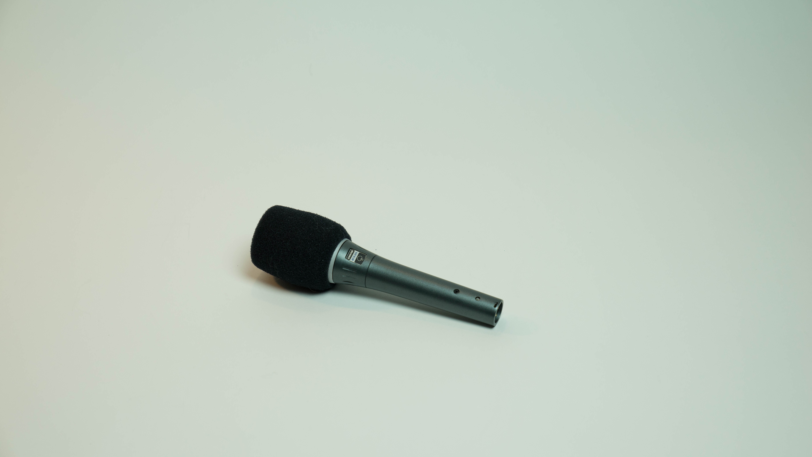
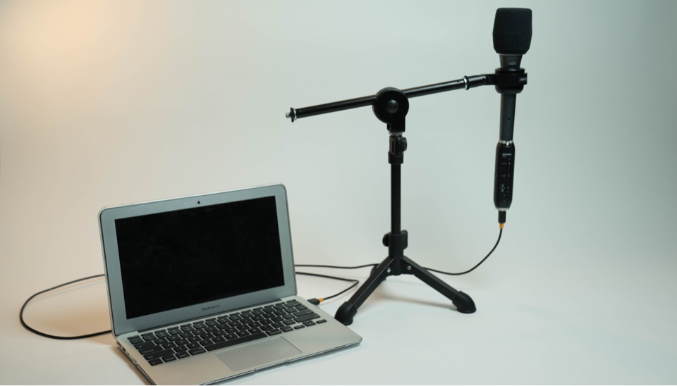

egghead provides every instructor with professional audio equipment so that you sound amazing. It's free, with no obligation. The gift of pro audio.

Amazing audio quality starts with quality gear. Your laptop’s built-in microphone sounds "fine", but we want you to sound way better than "fine".

When you become an egghead instructor, we hook you up! As soon as you have a draft lesson almost ready to publish, we’ll send you a waterproof Pelican case full of professional-grade audio recording equipment. 📬

Here’s what you’ll be getting:

- K & M 23150-500-55 tabletop microphone stand with 5/8" threaded connector and mini boom arm
- Shure BETA 87A microphone
- Shock mount to attach the mic to the stand
- Shure X2U XLR-to-USB signal adapter
- 1 XLR cable to connect the microphone to the USB interface
- Badass by Kathy Sierra (to inspire your great ideas)

Let’s go through each piece of equipment and explain how you’ll use it.

### Microphone boom

The boom is a stand for your mic. Booms can range in size and shape. (Action movies require bigger booms than egghead lessons.) This is a very nice, sturdy boom from Germany that folds down for easy storage in the case.

### The microphone

Obviously an important piece of equipment! The **Shure BETA 87a** is a [supercardioid](http://blog.shure.com/multi-pattern-microphones-what-where-and-how/) mic, which refers to how it picks up sound: It’s forgiving and blocks out ambient noise.

You can go crazy with mics, spending a huge amount for a smidge better sound quality. You might not use this mic to record a #1 banger, but it still fits into the "sounds very good" column. 👍

Positioning of the mic is important. You should be 2–6 inches away for optimal volume levels. For extra credit, here are loads more positioning tips:

(We don’t really give out extra credit, but you might sound _slightly_ better.)

### Shock mount (right)

This little piece connects to the boom, and the microphone slides into it before being attached to the XLR cable. It will dampen any footsteps or other vibrations that might be picked up through the stand to the mic. (You’ll most likely be sitting down, but who knows what your kids or roommates are up to.)

### USB audio interface (left)

The mic we’re giving you is built for professional audio applications, not necessarily for capturing audio on a computer. This interface connects the mic to your computer, and converts XLR analog signal into 1s and 0s for the computer to store. It has an XLR input (from the mic) and a USB output (to the computer).

Note:
⚡️ The 48v power button needs to be on!
⚡️ Turn the gain up!

### XLR cable

XLR is a plug used in professional audio applications. It isn't completely necessary since the pre-amp will plug directly into the microphone, but play around and see if it makes your sound more stable.

Your final setup should look something like this:

### Check audio input levels

Once your gear is set up, you'll need to check the audio input levels to make sure your gain is set properly. Here’s a lesson to help you:

<ResponsiveEmbed src="https://egghead.io/lessons/tools-prepare-to-record-screen-resolution-and-mic-check/embed" />

Ta-da! You’re ready to record.