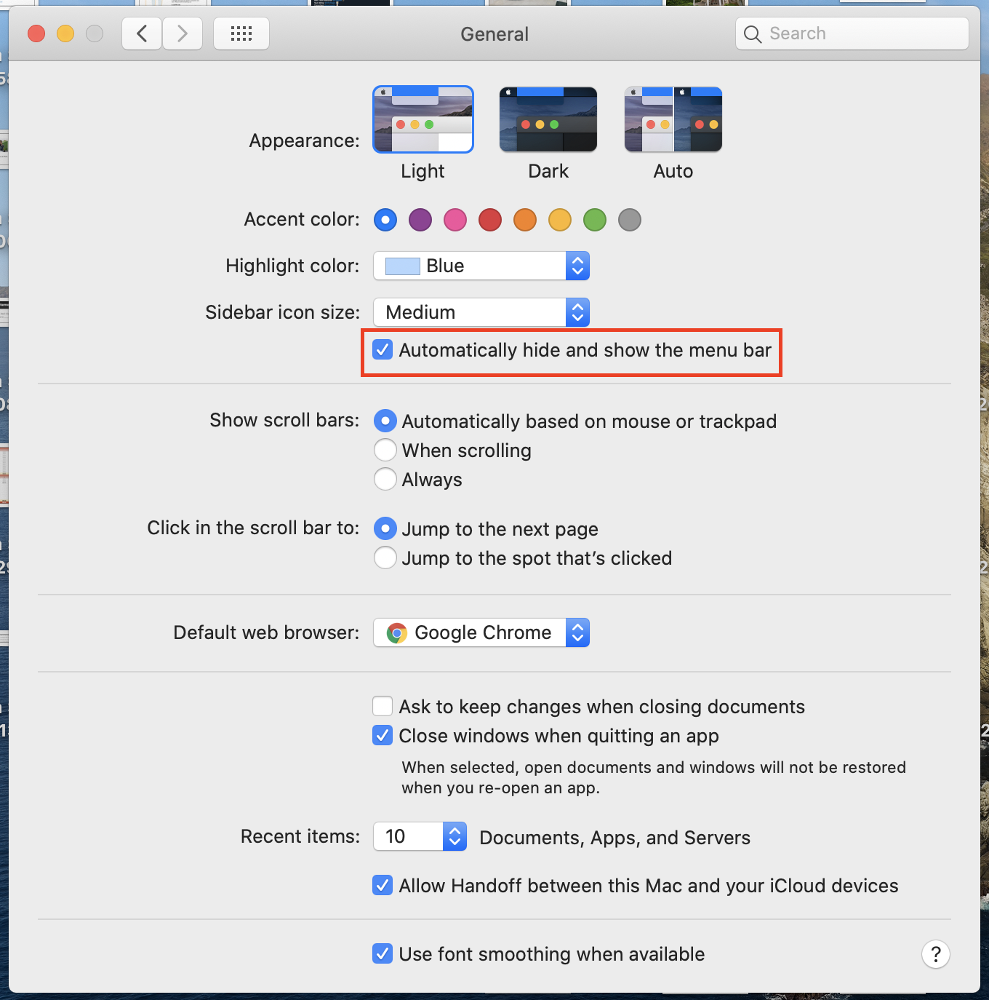
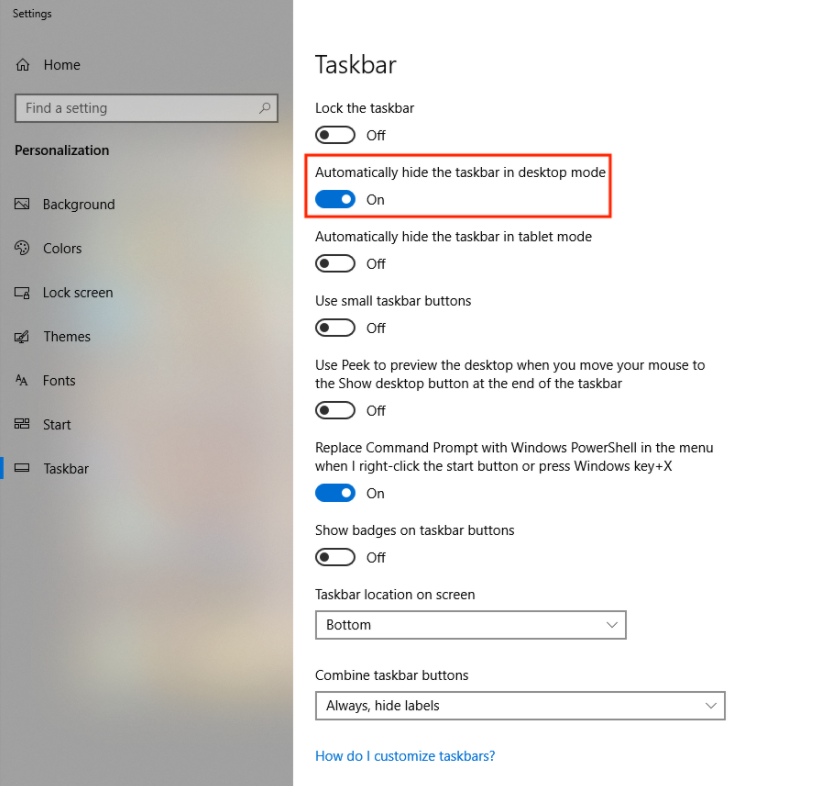

We want to remove as many distractions as possible when presenting, and one of the often-missed area of clutter is the **menu bar** on a Mac (**taskbar** on a Windows). It’s a small thing, but can add additional distraction onto the screen that can be avoided.

### Hide the Menu Bar on a Mac

You can hide the menu bar on your Apple computer by going to **System Settings > General > Checking “Automatically hide and show the menu bar**.

#### MacOS Big Sur
**System Settings > Dock & Menu Bar > Checking “Automatically hide and show the menu bar**.

### Hide the Taskbar on Windows 10

You can hide the taskbar on your Windows computer by **right clicking on the taskbar > Taskbar Settings > Checking “Automatically hide the taskbar in desktop mode**.

