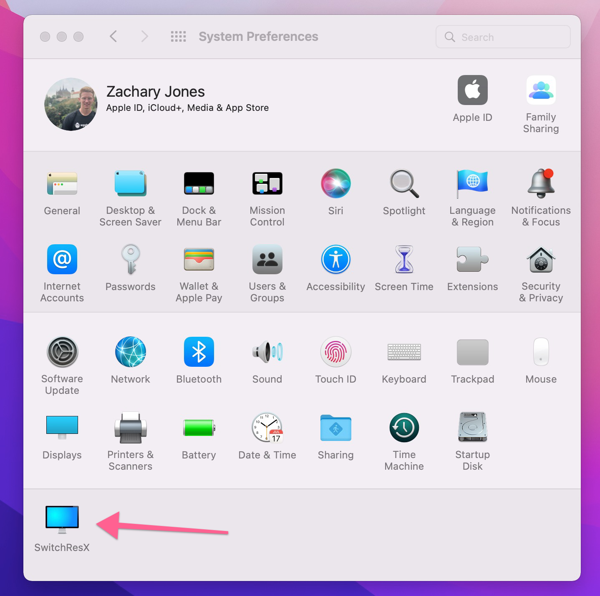
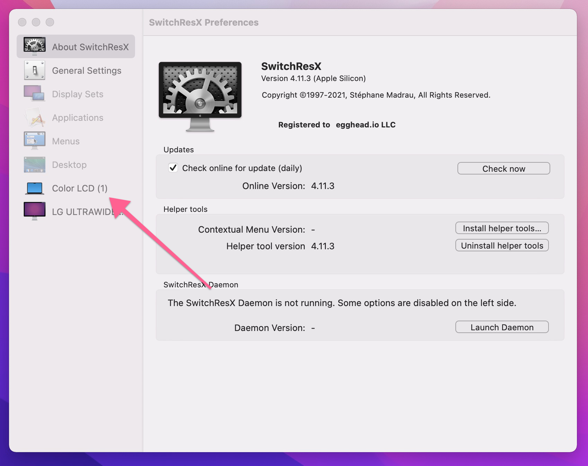
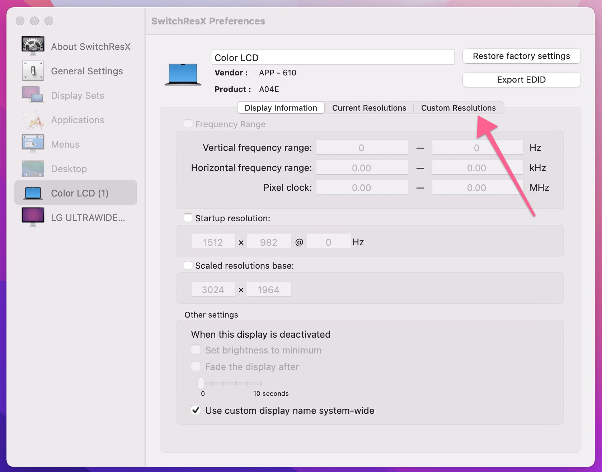

Newer versions of mac software have made it more difficult to set a proper 16:9 aspect ratio for recording your screen.

The video below walks you through creating a custom resolution in SwitchResX 

<ResponsiveEmbed src="https://www.loom.com/embed/9a51daa7cbb84e61b8b050e6a1ca6980" />

## Step by step Text Solution

1. Open SwitchResX from System Preferences:

2. Navigate to your mac screen menu:

3. Switch to the custom resolutions pane:

Add a custom resolution with an aspect ratio of 16:9.

1280x720, 1920x1080, and 2560x1440 will all work. [HiDPI prefered especially if you are using the 720 option.](/instructor/instructor-feedback-cycles/screen-setup/recording-lessons-in-hidpi-mode/)

We like 1280x720 HiDPI as a display res because the window is nice and scaled and very readable even on most phones.

If you want to deep dive on this, try out [BetterDummy](https://github.com/waydabber/BetterDummy) which will allow you to capture a flexible virtual display.