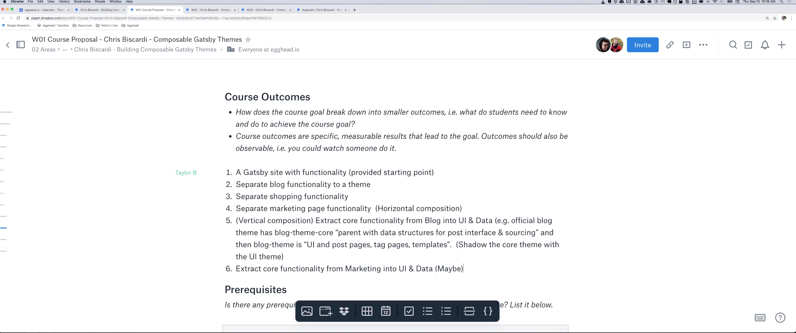

import {Box} from '@theme-ui/components'

export default ({children, ...props}) => (
  <Box variant="planningSession" {...props}>
    {props.header}
    {children}
  </Box>
)

[▶️ Session Recording Recording (13/9/2019)](https://www.dropbox.com/sh/7u9rintgb2ytoun/AAD_8tKUPRyk_jvCdGuSrtqWa?dl=0)

**Why is this topic important for somebody to learn?**

Gatsby themes are powerful abstractions that require a new mental model to fully take advantage of. This course will teach that mental model by example. As a result, this will enable learners to participate in the Gatsby theme ecosystem by:_ Building themes that have a good enough user experience to be sold on their own and used with other themes_. Understanding patterns for data abstraction, shadowing, and generally extending _other people's_ themes for use on their own sitesThe people that go through this workshop will become "Gatsby Theme Experts", who can go on to use their skills to build abstractions that enable faster building of sites for clients and converting themes from WordPress or other ecosystems.

**What should the learner be able to do at the end of the course?**

After completing this course, the desired end result is for learners to be comfortable creating themes that can compose with other themes in the Gatsby ecosystem without interfering with each other. These themes will enable their users to be able to source data from any Gatsby source, style pages without breaking other themes, and support users when they need to eject from child themes gracefully using parent themes. This course will probably _not_ cover: Using the same theme multiple times in the same site. Also known as "instancing" themes.

**What are the milestones that a student will reach as they work toward the big picture goal of this workshop?**

- Building GraphQL Interfaces with schema customization
- Backing those interfaces with concrete data types sourced from arbitrary nodes
- Isolating design tokens using custom React context
- Taking advantage of Predictive Shadowing, which enables themes to shadow other themes if they are installed
- Different Shadowing techniques such as "copying" and "extending" and what they mean for future upgradability
- Exposing options to theme users
- Architecting a suite of themes to work well together - npm dependency control - understanding how plugin options merge (or don't)
