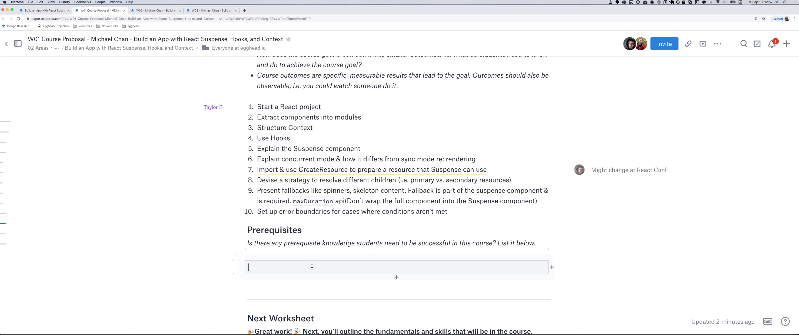

import {Box} from '@theme-ui/components'

export default ({children, ...props}) => (
  <Box variant="planningSession" {...props}>
    {props.header}
    {children}
  </Box>
)

[▶️ Session Recording Recording (11/9/2019)](https://www.dropbox.com/sh/ujg0s5wsuigm8ng/AADIG-sznut9nyzMb4raY_0Ya?dl=0)

**Why is this topic important for somebody to learn?**

React changed a lot last year with Hooks. It's poised to changed again this year with Suspense. This course will show folks how easy it is to build an API-backed application with Suspense, Hooks, and Context. Suspense is in production builds of React now but the react team hasn't provided a model cache. It's on the roadmap for fall 2019 and likely the primary focus of React Conf 2019.

**What should the learner be able to do at the end of the course?**

Build an application that fetches and posts data from a RESTful API using the latest React APIs: Suspens, Hooks, and Context.

**What are the milestones that a student will reach as they work toward the big picture goal of this workshop?**

- Build a data-less prototype
- Create Resources for collecting and interacting with data
- Fetch data from a RESTful API
- Orchestrate complex loading states with the Suspense component
- Create Resource-reading components
- Manage and clear a React Cache
- Post data to a RESTFUL API
- Organize an application with Resources, Hooks, Resources-reading components, and UI components.

**What will your example or demo be for this workshop?**

I created a [YouTube series on this content](https://www.youtube.com/playlist?list=PLnc_NxpmOxaPbyq_lEGZKWF7R3BbK3PSZ) in 2018, when I thought React Cache would be coming in spring. It's a 27 video series where we build a (paired down) Pokedex concept-by-concept. The application specifics could be changed from Pokemon to something else. But the application could structure could be largely the same. This could be GitHub repositories or some other type of silly resource.
