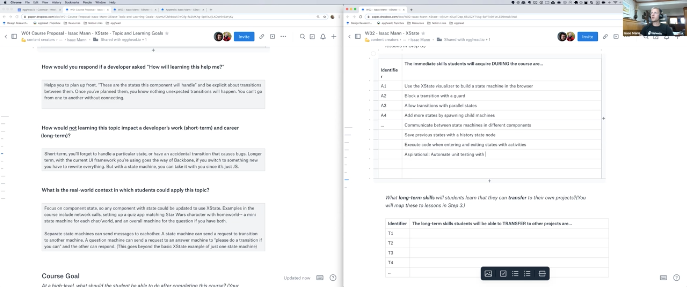

import {Box} from '@theme-ui/components'

export default ({children, ...props}) => (
  <Box variant="planningSession" {...props}>
    {props.header}
    {children}
  </Box>
)

[▶️ Session Recording Recording (16/10/2019)](https://www.dropbox.com/sh/opl9e77y6ltacw9/AADREKVL6_oGzh32JBOUXG6Ua?dl=0)

**Why is this topic important for somebody to learn?**

Using XState will:

- provide confidence that you've accounted for all states and transitions
- reuse common state machines across components
- keep local state local

**What should the learner be able to do at the end of the course?**

Write components that handle internal state in a predictable and re-usable way.

**What are the milestones that a student will reach as they work toward the big picture goal of this workshop?**

1. Handle http request state with xstate
2. Block a state transition with a guard
3. Allow transitions in any order with parallel states
4. Add more states by spawning child machines
5. Communicate between state machines in different components with the actor model
6. Save previous states with history states
7. Execute code when entering and exiting a state with activities

**What will your example or demo be for this workshop?**

The end goal is a quiz app in which users match a star wars character with their home world.

1. Handle http request state with xstate- A flaky network will be emulated- We'll use xstate to show the state of the network to load the list of characters and homeworlds.
2. Block a state transition with a guard- If the network request returns an empty array, that's still not enough to actually play the game, so we'll create a separate state for that case and use a guard to choose whether a successful response should go to the `hasData` or `noData` state.
3. Allow transitions in any order with parallel states- Users should be able to pick a character first and then a home world, or a home world and then a character. And the submit button should be enabled once both have been selected. We'll use parallel states to accomplish that.
4. Add more states by spawning child machines- After the submit button is pressed, we need to make a new question and track that state. We'll use the `spawn` function to create a new child machine for each new question.
5. Communicate between state machines in different components using the Actor model- All of this code lives in one component so far, but our apps have multiple components. We'll split the app into a list component and multiple question components with each component having its own state machine. Each component will update its own state machine when it receives an event from a different component.
6. Save previous states with history states- If a question is too hard, a user might want to skip it and come back. We'll add the ability to restore the selections that were made on previous questions when you return to them using history states.
7. Execute code when entering and exiting states with activities.- Activities are useful for anything that needs to be executed at the beginning and end of a state. Like an animation that needs to stop or an observable that needs to be unsubscribed. We'll add a completely spurious `Dark Side` mode for the quiz that makes all the ui elements float around the screen so that users have a more difficult time taking the quiz. Leaving `Dark Side` mode should return all elements to their original locations.
