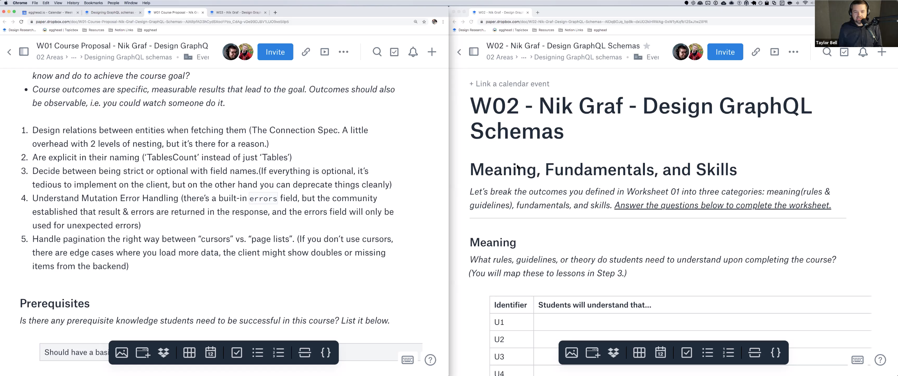

import {Box} from '@theme-ui/components'

export default ({children, ...props}) => (
  <Box variant="planningSession" {...props}>
    {props.header}
    {children}
  </Box>
)

[▶️ Session Recording (18/9/2019)](https://www.dropbox.com/s/27y7rqeug7aj4p9/Nik_Graf_GraphQL_Schema_proposal.mp4?dl=0)

**Why is this topic important for somebody to learn?**

GraphQL is getting more and more adoption and onboarding is covered by many resources. When people start to adopt it for production apps they start to struggle with the API design. GraphQL is even more flexible than REST and it’s easy to build an API where it’s hard to move forward.

**What should the learner be able to do at the end of the course?**

Students should feel comfortable designing a GraphQL API based on best practices like the Connection spec. They should have a strong understanding about designing mutations and the related error handling.

**What are the milestones that a student will reach as they work toward the big picture goal of this workshop?**

1. Naming of queries
2. Naming of query properties
3. IDs vs full objects for connected entities in queries
4. Curser vs pages for pagination in queries
5. Edges in the GraphQL Connection spec
6. Multiple arguments vs object input for Mutations
7. Handling expected Mutation errors
8. Handling unexpected Mutation & Query errors

**What will your example or demo be for this workshop?**

Either a location guide or a web shop could be great examples. Both can start simple and it’s clear how they can expand to cover more complex cases. This I believe is very important for explaining advanced design concepts.
