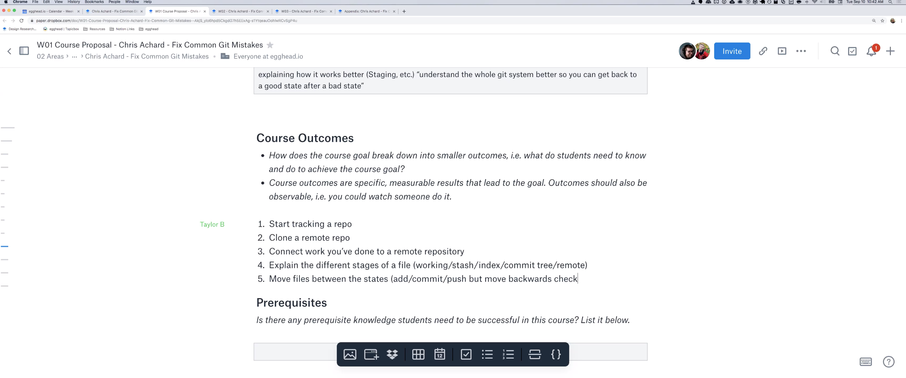

import {Box} from '@theme-ui/components'

export default ({children, ...props}) => (
  <Box variant="planningSession" {...props}>
    {props.header}
    {children}
  </Box>
)

[▶️ Session Recording Recording (13/9/2019)](https://www.dropbox.com/sh/xr52l23zugwnz6w/AAD9AwbSHU8qZvrpFvMbIC6Va?dl=0)

**Why is this topic important for somebody to learn?**

Programmers use git all day, everyday, but it's still common to get stuck into situations and have no idea how to get out without a lot of hassle. When you really know the git workflow well, it can speed up development, and reduce the hassle of getting stuck in a bad state.

**What should the learner be able to do at the end of the course?**

Use git confidently! Or at least: recognize when they're in a situation that they can get out of gracefully.

**What are the milestones that a student will reach as they work toward the big picture goal of this workshop?**

1. Understand how files are stored, cached, and pushed
2. How to do and undo "add", "stash", "commit", "push"
3. What to do when there are conflicts in merges
4. How to switch branches gracefully
5. Know what operations are destructive, and know how to not lose a bunch of work
6. Handle gitignore properly, including ignoring files you've already commited
7. Understand what origin is, and how to handle complicated server situations
8. Merge vs rebase (and other workflow considerations)

**What will your example or demo be for this workshop?**

I imagine it would be like a "cookbook" workshop, or a bunch of mini-lessons. "Here's how you could mess it up; now here's how to fix it". Perhaps there would also need to be an intro part to explain the git file/branch model as well, just so everyone is on the same page
