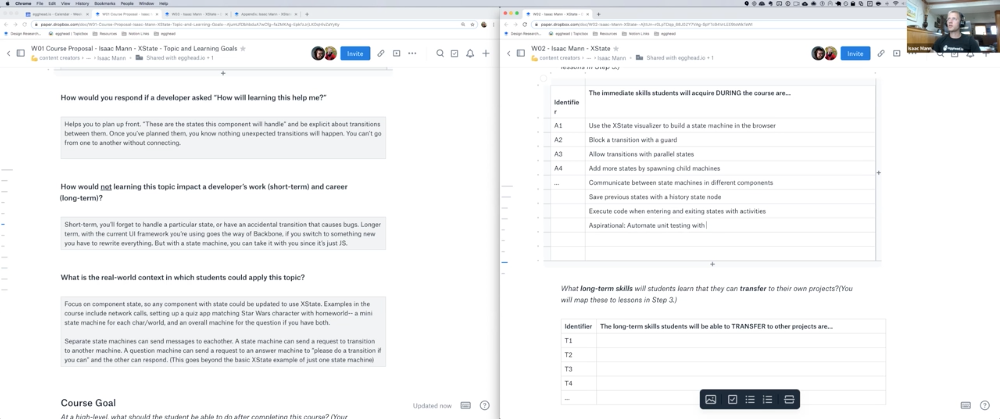

import {jsx} from 'theme-ui'
import {Box, Image} from '@theme-ui/components'

Lorem ipsum dolor sit amet, consectetur adipiscing elit. Fusce et orci diam. Etiam imperdiet dignissim ex ultrices commodo. Duis dignissim nisi fermentum est venenatis, vehicula ultricies odio vehicula. Quisque efficitur nibh id enim cursus, ac molestie risus sodales. Nulla a facilisis risus, non semper tortor. Nunc tincidunt sem sed posuere euismod. Praesent laoreet suscipit ex vitae venenatis.

## Here are 6 examples of Planning Sessions with egghead instructors:

<Box variant="planningSession" 
>
<Flex variant="planningSessionHeader">

<Image
  src="https://d2eip9sf3oo6c2.cloudfront.net/series/square_covers/000/000/405/full/DesignGraphQLSchemas.png"
  alt="Illustration for Designing GraphQL Schemas by Nik Graf course on egghead.io"
/>

### Nik Graf - Designing GraphQL Schemas

</Flex>

[▶️ Session Recording Recording (18/9/2019)](https://www.dropbox.com/s/27y7rqeug7aj4p9/Nik_Graf_GraphQL_Schema_proposal.mp4?dl=0)

**Why is this topic important for somebody to learn?**

GraphQL is getting more and more adoption and onboarding is covered by many resources. When people start to adopt it for production apps they start to struggle with the API design. GraphQL is even more flexible than REST and it’s easy to build an API where it’s hard to move forward.

**What should the learner be able to do at the end of the course?**

Students should feel comfortable designing a GraphQL API based on best practices like the Connection spec. They should have a strong understanding about designing mutations and the related error handling.

**What are the milestones that a student will reach as they work toward the big picture goal of this workshop?**

1. Naming of queries
2. Naming of query properties
3. IDs vs full objects for connected entities in queries
4. Curser vs pages for pagination in queries
5. Edges in the GraphQL Connection spec
6. Multiple arguments vs object input for Mutations
7. Handling expected Mutation errors
8. Handling unexpected Mutation & Query errors

**What will your example or demo be for this workshop?**

Either a location guide or a web shop could be great examples. Both can start simple and it’s clear how they can expand to cover more complex cases. This I believe is very important for explaining advanced design concepts.

</Box>

<Box variant="planningSession" 
>
<Flex variant="planningSessionHeader">

<Image
  src="https://d2eip9sf3oo6c2.cloudfront.net/series/square_covers/000/000/401/full/GitMistakes_1000.png"
  alt="Illustration for Designing GraphQL Schemas by Nik Graf course on egghead.io"
/>

### Chris Achard - Fix Common Git Mistakes

</Flex>

[▶️ Session Recording Recording (13/9/2019)](https://www.dropbox.com/sh/xr52l23zugwnz6w/AAD9AwbSHU8qZvrpFvMbIC6Va?dl=0)

**Why is this topic important for somebody to learn?**

Programmers use git all day, everyday, but it's still common to get stuck into situations and have no idea how to get out without a lot of hassle. When you really know the git workflow well, it can speed up development, and reduce the hassle of getting stuck in a bad state.

**What should the learner be able to do at the end of the course?**

Use git confidently! Or at least: recognize when they're in a situation that they can get out of gracefully.

**What are the milestones that a student will reach as they work toward the big picture goal of this workshop?**

1. Understand how files are stored, cached, and pushed
2. How to do and undo "add", "stash", "commit", "push"
3. What to do when there are conflicts in merges
4. How to switch branches gracefully
5. Know what operations are destructive, and know how to not lose a bunch of work
6. Handle gitignore properly, including ignoring files you've already commited
7. Understand what origin is, and how to handle complicated server situations
8. Merge vs rebase (and other workflow considerations)

**What will your example or demo be for this workshop?**

I imagine it would be like a "cookbook" workshop, or a bunch of mini-lessons. "Here's how you could mess it up; now here's how to fix it". Perhaps there would also need to be an intro part to explain the git file/branch model as well, just so everyone is on the same page

</Box>

<Box variant="planningSession" 
>
<Flex variant="planningSessionHeader">

<Image
  src="https://d2eip9sf3oo6c2.cloudfront.net/series/square_covers/000/000/354/full/VueRouter.png"
  alt="Illustration for Journey with Vue-Router by Laurie Barth course on egghead.io"
/>

### Laurie Barth - Journey with Vue-Router

</Flex>

[▶️ Session Recording Recording (6/9/2019)](https://www.dropbox.com/sh/vo719goa0mddu1l/AABGSsP-ovmkTfPGe6UsPYOIa?dl=0)

This is an example where the initial submission was somewhat sparse, but we ended up fleshing it out well during the proposal session.

#### Original Proposal Submission

**Why is this topic important for somebody to learn?**

Routers are powerful and an essential part of any application. Learning how to use the vue-router is important for anyone building a vue application.

**What should the learner be able to do at the end of the course?**

Use vue-router and all of its built in functionality in an application.

**What are the milestones that a student will reach as they work toward the big picture goal of this workshop?**

Create a basic router, create sub-routes, create wildcard path routes, create an interceptor for routes.

**What will your example or demo be for this workshop?**

</Box>

<Box variant="planningSession" 
>
<Flex variant="planningSessionHeader">

<Image
  src="https://d2eip9sf3oo6c2.cloudfront.net/series/square_covers/000/000/355/full/GatsbyThemes.png"
  alt="Illustration for Composable Gatsby Themes by Chris Biscardi course on egghead.io"
/>

### Chris Biscardi - Composable Gatsby Themes

</Flex>

[▶️ Session Recording Recording (13/9/2019)](https://www.dropbox.com/sh/7u9rintgb2ytoun/AAD_8tKUPRyk_jvCdGuSrtqWa?dl=0)

**Why is this topic important for somebody to learn?**

Gatsby themes are powerful abstractions that require a new mental model to fully take advantage of. This course will teach that mental model by example. As a result, this will enable learners to participate in the Gatsby theme ecosystem by:* Building themes that have a good enough user experience to be sold on their own and used with other themes*. Understanding patterns for data abstraction, shadowing, and generally extending *other people's* themes for use on their own sitesThe people that go through this workshop will become "Gatsby Theme Experts", who can go on to use their skills to build abstractions that enable faster building of sites for clients and converting themes from WordPress or other ecosystems.

**What should the learner be able to do at the end of the course?**

After completing this course, the desired end result is for learners to be comfortable creating themes that can compose with other themes in the Gatsby ecosystem without interfering with each other. These themes will enable their users to be able to source data from any Gatsby source, style pages without breaking other themes, and support users when they need to eject from child themes gracefully using parent themes. This course will probably *not* cover: Using the same theme multiple times in the same site. Also known as "instancing" themes.

**What are the milestones that a student will reach as they work toward the big picture goal of this workshop?**

* Building GraphQL Interfaces with schema customization
* Backing those interfaces with concrete data types sourced from arbitrary nodes
* Isolating design tokens using custom React context
* Taking advantage of Predictive Shadowing, which enables themes to shadow other themes if they are installed
* Different Shadowing techniques such as "copying" and "extending" and what they mean for future upgradability
* Exposing options to theme users
* Architecting a suite of themes to work well together - npm dependency control - understanding how plugin options merge (or don't)

</Box>

<Box variant="planningSession" 
>
<Flex variant="planningSessionHeader">

<Image
  src="https://d2eip9sf3oo6c2.cloudfront.net/series/square_covers/000/000/402/full/State_Machine.png"
  alt="Illustration for Construct Sturdy UIs with XState by Isaac Mann course on egghead.io"
/>

### Isaac Mann - Building UIs with XState State Machines

</Flex>

[▶️ Session Recording Recording (16/10/2019)](https://www.dropbox.com/sh/opl9e77y6ltacw9/AADREKVL6_oGzh32JBOUXG6Ua?dl=0)

**Why is this topic important for somebody to learn?**

Using XState will:
- provide confidence that you've accounted for all states and transitions
- reuse common state machines across components
- keep local state local

**What should the learner be able to do at the end of the course?**

Write components that handle internal state in a predictable and re-usable way.

**What are the milestones that a student will reach as they work toward the big picture goal of this workshop?**

1. Handle http request state with xstate
2. Block a state transition with a guard
3. Allow transitions in any order with parallel states
4. Add more states by spawning child machines
5. Communicate between state machines in different components with the actor model
6. Save previous states with history states
7. Execute code when entering and exiting a state with activities

**What will your example or demo be for this workshop?**

The end goal is a quiz app in which users match a star wars character with their home world.

1. Handle http request state with xstate- A flaky network will be emulated- We'll use xstate to show the state of the network to load the list of characters and homeworlds.
2. Block a state transition with a guard- If the network request returns an empty array, that's still not enough to actually play the game, so we'll create a separate state for that case and use a guard to choose whether a successful response should go to the `hasData` or `noData` state.
3. Allow transitions in any order with parallel states- Users should be able to pick a character first and then a home world, or a home world and then a character. And the submit button should be enabled once both have been selected. We'll use parallel states to accomplish that.
4. Add more states by spawning child machines- After the submit button is pressed, we need to make a new question and track that state. We'll use the `spawn` function to create a new child machine for each new question.
5. Communicate between state machines in different components using the Actor model- All of this code lives in one component so far, but our apps have multiple components. We'll split the app into a list component and multiple question components with each component having its own state machine. Each component will update its own state machine when it receives an event from a different component.
6. Save previous states with history states- If a question is too hard, a user might want to skip it and come back. We'll add the ability to restore the selections that were made on previous questions when you return to them using history states.
7. Execute code when entering and exiting states with activities.- Activities are useful for anything that needs to be executed at the beginning and end of a state. Like an animation that needs to stop or an observable that needs to be unsubscribed. We'll add a completely spurious `Dark Side` mode for the quiz that makes all the ui elements float around the screen so that users have a more difficult time taking the quiz. Leaving `Dark Side` mode should return all elements to their original locations.

</Box>

<Box variant="planningSession" 
>
<Flex variant="planningSessionHeader">

<Image
  src="https://d2eip9sf3oo6c2.cloudfront.net/series/square_covers/000/000/399/full/React_Suspense_Final.png"
  alt="Illustration for Build an App with React Suspense by Michael Chan course on egghead.io"
/>

### Michael Chan - Build an App with React Suspense

</Flex>

[▶️ Session Recording Recording (11/9/2019)](https://www.dropbox.com/sh/ujg0s5wsuigm8ng/AADIG-sznut9nyzMb4raY_0Ya?dl=0)

**Why is this topic important for somebody to learn?**

React changed a lot last year with Hooks. It's poised to changed again this year with Suspense. This course will show folks how easy it is to build an API-backed application with Suspense, Hooks, and Context. Suspense is in production builds of React now but the react team hasn't provided a model cache. It's on the roadmap for fall 2019 and likely the primary focus of React Conf 2019.

**What should the learner be able to do at the end of the course?**

Build an application that fetches and posts data from a RESTful API using the latest React APIs: Suspens, Hooks, and Context.

**What are the milestones that a student will reach as they work toward the big picture goal of this workshop?**

* Build a data-less prototype
* Create Resources for collecting and interacting with data
* Fetch data from a RESTful API
* Orchestrate complex loading states with the Suspense component
* Create Resource-reading components
* Manage and clear a React Cache
* Post data to a RESTFUL API
* Organize an application with Resources, Hooks, Resources-reading components, and UI components.

**What will your example or demo be for this workshop?**

I created a [YouTube series on this content](https://www.youtube.com/playlist?list=PLnc_NxpmOxaPbyq_lEGZKWF7R3BbK3PSZ) in 2018, when I thought React Cache would be coming in spring. It's a 27 video series where we build a (paired down) Pokedex concept-by-concept. The application specifics could be changed from Pokemon to something else. But the application could structure could be largely the same. This could be GitHub repositories or some other type of silly resource.

</Box>