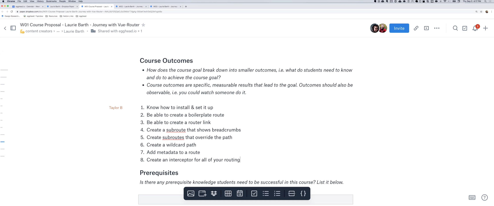

import {Box} from '@theme-ui/components'

export default ({children, ...props}) => (
  <Box variant="planningSession" {...props}>
    {props.header}
    {children}
  </Box>
)

[▶️ Session Recording Recording (6/9/2019)](https://www.dropbox.com/sh/vo719goa0mddu1l/AABGSsP-ovmkTfPGe6UsPYOIa?dl=0)

This is an example where the initial submission was somewhat sparse, but we ended up fleshing it out well during the proposal session.

#### Original Proposal Submission

**Why is this topic important for somebody to learn?**

Routers are powerful and an essential part of any application. Learning how to use the vue-router is important for anyone building a vue application.

**What should the learner be able to do at the end of the course?**

Use vue-router and all of its built in functionality in an application.

**What are the milestones that a student will reach as they work toward the big picture goal of this workshop?**

Create a basic router, create sub-routes, create wildcard path routes, create an interceptor for routes.
