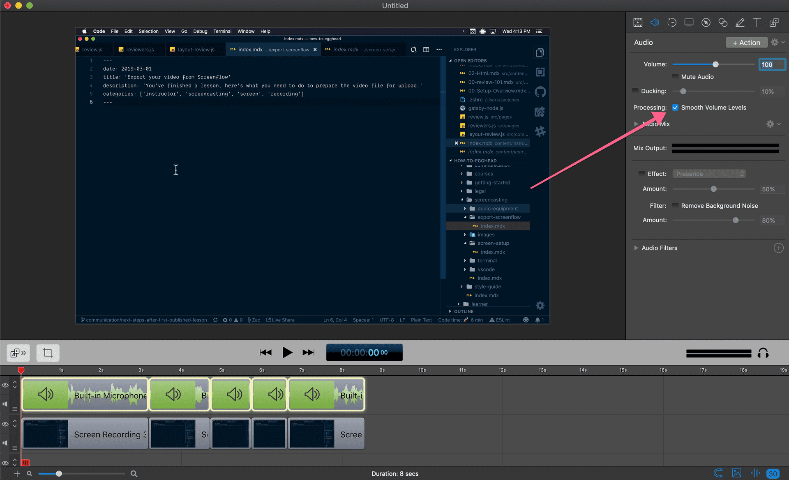
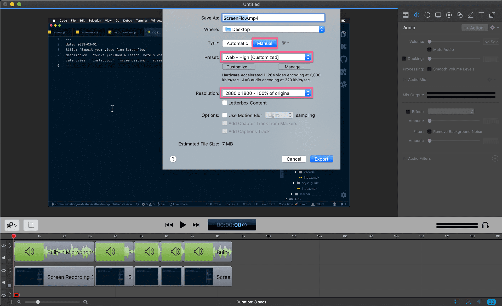
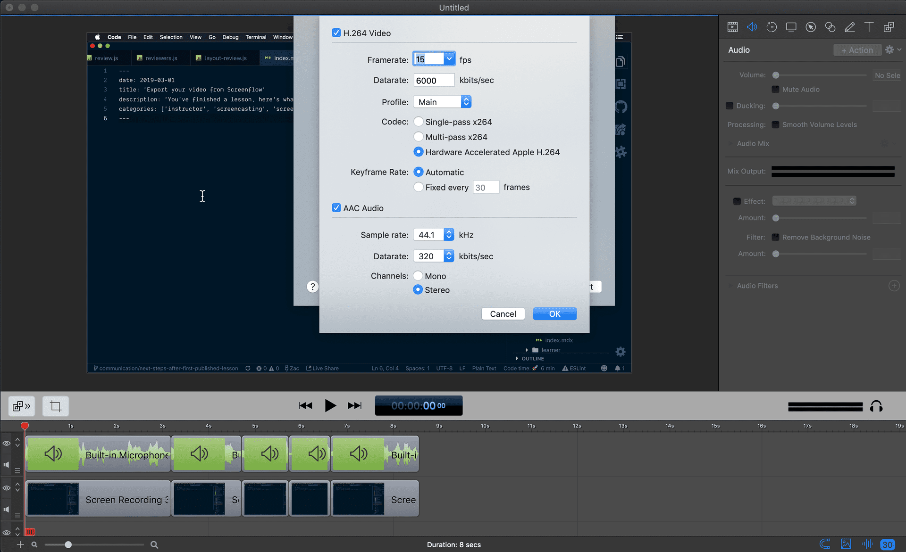

# Export Your Video from ScreenFlow

Once you have a lesson recorded, there are a couple steps to take to ensure your lesson sounds and looks good.

Before exporting the file from screenflow, select all the audio clips, click the audio tab, and find the `Smooth Volume Levels` checkbox. This will generally increase the volume of your lesson as well as reduce the variation in levels for smoother transitions between clips.

Now that's complete, you can export.

To do so, hit `⌘+E` or navigate to `File` and look for `Export`.

You'll be presented with a dialog similar to this:

The key settings to note is setting the `Type` to `Manual`, `Preset` to `Web - High [Customized]`, and the `Resolution` to `100% of the original`.

The important part in regards to screen resolution is that the aspect ratio is 19:6. If you don't have your screen set to that aspect ratio, no worries, check [this video](https://egghead.io/lessons/egghead-fix-your-video-resolution-in-screenflow-after-you-accidentally-recorded-the-wrong-size) from John on how to save the lesson.

Click the `Customize` button under the `Preset` Dialog. This will open up a new dialog for you:

Unless you're doing animation, 15 fps will be fine for your video. If you are doing animation, select 30 fps. The Hardware Accelerated option for `Codec` is recommended as it will be the fastest but Single Pass would also be fine.

44.1 kHz `Sample rate` and 320 kbits/sec `Datarate` with channel set to `Stereo` will ensure the audio is crispy.

Now you're ready, [upload away](https://egghead.io/lesson_uploads/new).