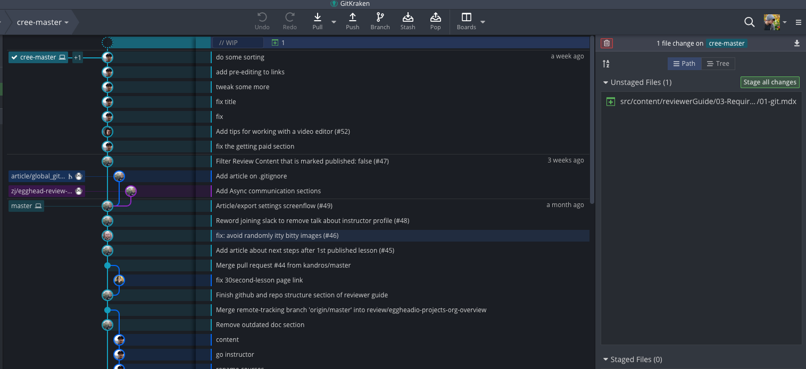

# Learning Git

Git is the standard tool used by teams to all work on the same project together. It allows everyone to make copies of the original project, make changes to their copies, and then merge their changes into the original without getting in the way of anyone else's work.

## Git Terminology

Git has some fancy jargon that everyone uses, but what does it all mean and how does it connect? Let's break it down into layman's terms! 👨‍🏫

### Change

*Git* keeps track of all of the files in a project. Whenever you make a change to a file, git knows precisely what you've changed and keeps track of it. 

### Commit

A *commit* is a **collection of changes**. Whenever you make a commit you are telling git that you'd like it to save all of the changes that you've made. 

### Branch

A *branch* is just a **sequence of commits**, so all of the changes you've made starting from the beginning of the project. 

Whenever you *branch* you split off from the commit you are at currently. **Other branches don't keep track of the commits you make on a separate branch**, this allows you to make changes without stepping on anyone else's toes! 

### Repository

A *repository*, also known as a *repo*, is a collection of branches. It is the entire project, every commit on every branch. 

### Remote

A remote is a repository that isn't the one you are in currently. You can link to a remote to push and pull from it. 

### Push

When you *push,* you **upload your commits** from a branch on your computer to a **remote** repository's branch

### Pull

When you *pull,* you **download the commits** from a remote repository's branch to a repository on **your computer's** branch. 

### Merge

*Merging* is when you **synchronize** the commits of two branches. 

In a collaborative project, when someone wants to make a change, they make a branch off of a main branch known as the *master* branch. After they commit changes they've made to their branch, they would merge their commits into the master branch.

A *merge conflict* is when two commits change the same thing! 

### 🐙 GitHub

*GitHub* is a website that hosts remote repositories! 

### Clone

A *clone* is a copy of a remote repository. If you don't have permissions, you cannot push changes to the remote. 

### Fork

A *fork* is a clone of a repository on Github under your name. You can push changes to your forked repository!

## So how do you use git?

There are a couple of options. You can either use a GUI, which is an app that provides a visual interface, or you can use your command line and run the commands yourself. 

The GUI that we recommend that you use is **Git Kraken**. Git Kraken provides an excellent diagram of all of the branches and changes, and it makes cloning projects and committing your work much easier. 

### How do you use Git Kraken?

Git Kraken has an excellent tutorial on how to use the product, I highly recommend you read this article and watch the videos. [https://support.gitkraken.com/start-here/guide/](https://support.gitkraken.com/start-here/guide/)

### How do you use Git from the command line?

[This tutorial from code academy](https://www.codecademy.com/learn/learn-git) will take you through the workflow basics, how to undo any mistakes you make, branching, and collaborating with other people

### Taking it Further

If you'd like to learn git a bit more in depth, [egghead.io](http://egghead.io) has the course [Practical Git for Everyday Professional Use](https://egghead.io/courses/practical-git-for-everyday-professional-use)!