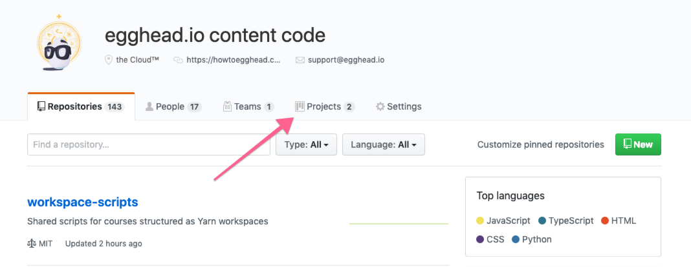
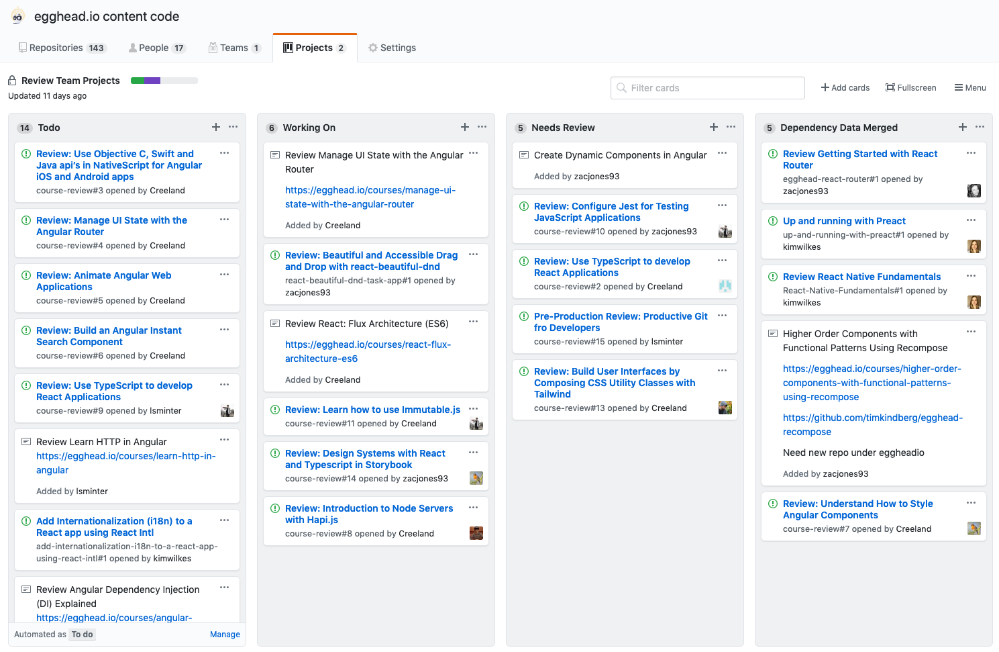
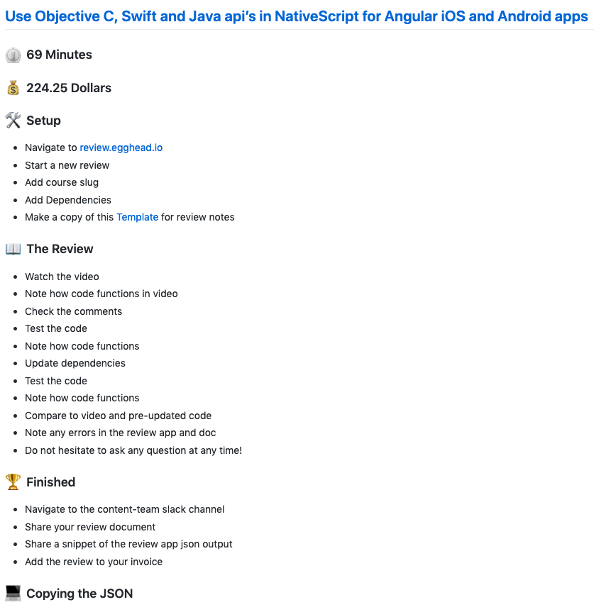

## GitHub

[GitHub](https://github.com/) is a website and service used to store and track the development of software. It does this through Git which the tool that actually keeps track and manages code.

GitHub is a hosting service for projects (repositories) that use Git. It's not the only service that does this but is widely accepted, especially in Web Development.

For more specifics on Git, visit our Prerequisite section [link to that].

## GitHub & the Review Team

GitHub is where we store code examples for the content that is created at egghead. Specifically, all code is stored under the [eggheadio-projects organization]([https://github.com/eggheadio-projects](https://github.com/eggheadio-projects)).

Each repository (with a few exceptions) in this organization will correlate to a course that has been or will be published on egghead.

## Github Projects

Work is assigned through GitHub Projects which can be found [here](https://github.com/orgs/eggheadio-projects/projects/1).

You can navigate to the project from the organization home page here:

Then select `Review Team Projects`

This will bring you to all the current reviews that are currently being worked on as well as available for review.

On this board we have 4 columns: `Todo`, `Working On`, `Needs Review`, and `Dependency Data Merged`.

When a course is flagged for review, it will be added to the `Todo` column as an issue by a Review Team Admin. When you are ready for a new project, you can assign yourself to the issue and drag the issue to the `Working On` Column.

When a review is done, you will need to move the related issue to the `Needs Review` column for review by a Review Team Admin. In addition you'll need to post to Slack (covered in next section).

When the review is approved, the issue will be closed and moved to the `Dependency Data Merged` column. 

## Review Project Issue

This will take you to the full issue page that will describe for you what needs to be done and give appropriate links for you to start the project.

Each card will have the lesson minutes and pay at the top of the card as well as quick references for `Setup`, `The Review`, `Finished`, and `Copying the JSON` (We'll cover more specifics in the review section). 

In addition, more context will be added to the top of the card when available. Notes on previous pain points in past reviews, comments from customers, relevant changelog notes of a specific technology, etc.