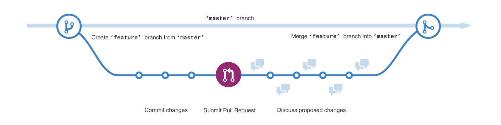

# Review Process Steps

# Glossary
- **Repo** - source code on Github called a *repository*.
- **Issue** - conversation in a *repo* before proposing changes.
- **PR** - special *issue* attached to proposed changes called a *pull request*.
- **Code review** - *PR* approval process with conversations attached to specific lines of code.
- **Project board** - the *eggheadio-projects* GitHub organization's [project board](https://github.com/orgs/eggheadio-projects/projects/1).

# Steps
## Anyone (e.g. end users or Greenkeeper)
1. Create an *issue* in a *repo*.
2. GitHub automatically adds the issue to the **To do** column on the *project board*.

## Reviewer
1. Pick an issue from the **To do** column on the project board.
2. Manually move the issue to the **In progress** column on the project board.
3. Assign yourself to the issue.
4. Fork the repo.
5. Commit updated dependencies and lock file.
6. Commit changes to resolve the issue.
7. Commit updated changelog.
8. Close the issue in a commit message.
9. Create a *PR* and [allow changes to your PR’s branch](https://help.github.com/en/articles/allowing-changes-to-a-pull-request-branch-created-from-a-fork).
10. GitHub automatically adds the PR (not the issue) to the **Code review** column on the project board.
11. Commit changes requested in the *code review*.

## Continuous Integration `TODO: Milestone 1`
1. Lint changelog.
2. Check install for errors.
3. Check build for errors.
4. Check tests for errors.

## Admin
1. Request changes in the code review.
2. [Check out](https://www.atlassian.com/git/tutorials/using-branches/git-checkout) the PR in [official VS Code extension](https://vscode.rocks/github-pr-extension/).
3. Commit updated lock file [to the PR’s branch](https://help.github.com/en/articles/committing-changes-to-a-pull-request-branch-created-from-a-fork) if it was updated in CodeSandbox.
4. Approve the PR.
5. Merge the PR.
6. GitHub automatically moves the PR to the **Resolved** column on the project board.
7. GitHub automatically closes the issue and moves it to the **Done** column on the project board.
8. Manually move the PR to the **Done** column on the project board when deployed.

## Web Service `TODO: Milestone 2`
1. Receive `[pull_request](https://developer.github.com/v3/activity/events/types/#pullrequestevent)` [event](https://developer.github.com/v3/activity/events/types/#pullrequestevent) from GitHub webhook.
2. Process changelog.
3. Update database.

# Updating Dependencies

Run `yarn latest`, `A`, `Return` in the workspace root. Currently, it aliases `yarn upgrade-interactive --latest && yarn upgrade -L`.

# Changelog Format

Install the [VS Code extension](https://marketplace.visualstudio.com/items?itemName=dzgmelody.vscode-changelog-snippets).

## Template
    # Changelog

    All notable changes to this project will be documented in this file.

    The format is based on \[Keep a Changelog\](https://keepachangelog.com/en/1.0.0/),
    and this project adheres to \[Semantic Versioning\](https://semver.org/spec/v2.0.0.html).

    ## [Unreleased]

    ### Added

    ### Changed

    ### Deprecated

    ### Removed

    ### Fixed

    ### Security

    ## 1.0.0 - YYYY-MM-DD

    ### Added

    - This file.

