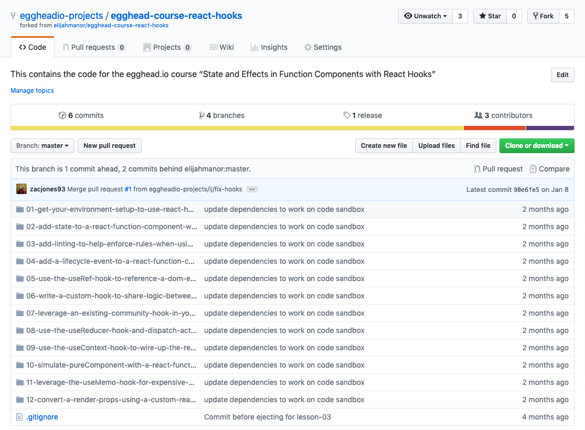
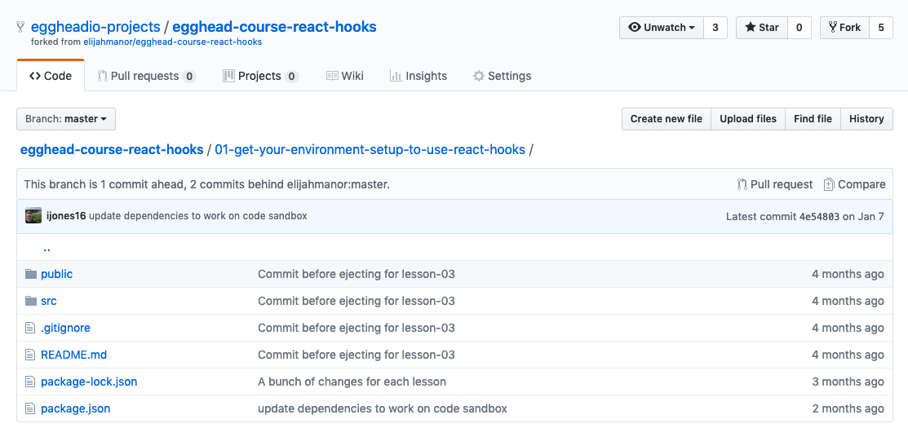
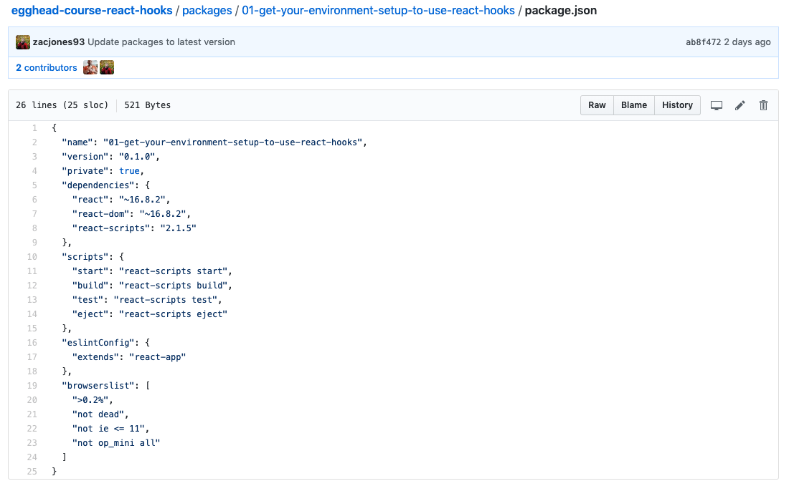
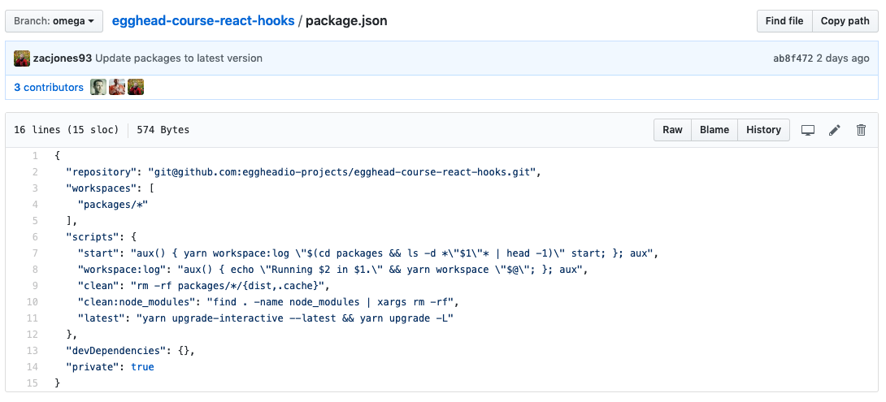

## Your course code example
A course typically has one code example that acts as a connecting thread through the course. You’ll build on it from lesson to lesson.

For every egghead lesson, we provide a concise, organized, readable code example below the lesson video in a runnable embed, using CodeSandbox or a similar service. That way, egghead members can jump in right away.

The structure that has worked best is to place each lesson example in it's own folder on the `master` branch numbered acording to the lesson order in the course. This allows for quick access to each lesson without the hassle of switching branches (this is important for further maintanence!). 

Here's an example of the structure that we expect: 

Each folder contains a create-react-app application that's ready to run.

### How Code is Shared

For each lesson in a course, a code example is provided in its finished state below the video so learners can explore the code on their own.

[CodeSandbox](https://codesandbox.io/) is our favorite tool for creating and delivering our examples. If this won’t work for the code, we use a GitHub repository to store the code example and share that on the lesson page. GitHub repo examples will be structured in the same way, where each folder is the *finished* state of the given lesson. 

Poviding a `app.start.js` file (or folder if a few files in one lesson are touched) is a great way to encourage students to code the lesson themselves.

### Enhnacements to the Code Example

To further the useability of each repository, egghead will implement [Yarn Workspaces](https://yarnpkg.com/blog/2017/08/02/introducing-workspaces/) which allow anyone to `yarn install` once for the entire repository and each lesson will be ready to run. No more hassle for the student to install in every lesson folder.

This is opt in for each student as she can still navigate to the lesson folder and `npm` or `yarn` install, but for maintanence purposes, workspaces greatly increase the speed of updating and ensuring every lesson is running as it should.

Two additional requirements for each lesson folder are a unique `name` in it's respective `package.json` file as well as `version` set.

As seen [here in this example](https://github.com/eggheadio-projects/egghead-course-react-hooks/tree/omega):

Next, all lesson folders (or workspaces) are aggregated in a `packages` folder and a global `package.json` file is created to enable the workspaces. 

Within that `package.json` file, you'll set `workspaces` to `packages/*` and `private` to `true`. Now you're all set up with what you need to run each example as a workspace.

You'll notice that we've added a few handy scripts in this global `package.json` that allow you to easily run and update each lesson.

`yarn start 01`

💥 The first lesson is ran.