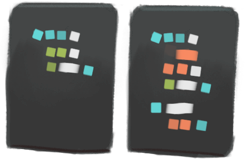

## Create your 30-second lesson

We want to help new instructors get the hang of egghead style as fast as possible. We know you won’t nail it right away—that’s okay! That’s expected!—so instead of creating an entire lesson, we ask you to record a 30-second video first. That snippet will tell us plenty, and we’ll be able to give you feedback on your [code example](/create-your-code-example), [instruction style](/how-to-instruct), and the [technical stuff](/screencasting-tips).

### What we're looking for

Don't be too concerned about subject matter, audio, or video quality at this point. You want to dial in your:

- [basic instruction style](/how-to-instruct)
- [code example](/create-your-code-example)
- [screen dimensions](/prepare-your-screen-for-recording)
- [font sizes](/prepare-your-screen-for-recording)

Our [technical guide](/screencasting-tips) has you all the details you need to confidently press record. Think you have it figured out? Share a screenshot of your screen setup on [Slack](/egghead-on-slack).

### Pick a topic

...but of course, you’ll need to cover something specific. Since your video isn't intended for publication, keep it simple. No need to solve the internet just to impress us! Just pick a topic other web developers would find interesting, in the language of your choice. Python, Ruby, Rust, whatever you’re feeling.

Some quick ideas:

 Adding elements to an array

 Using variables in JavaScript template strings

 Centering elements in a div

Need help? Hit us up in your private [Slack channel](/egghead-on-slack).

### Start with the code

Before you record your clip, create your [example](/create-your-code-example): a before and after of your concept explained in code. You might provide the code in two states with a small diff explaining at a glance what your 30 seconds will teach. For simple topics, the before might be a blank screen—totally fine.

Need a gut check? Share your code on Slack using a [Github gist](/sharing-your-code).

### Hit record

You've got a topic. You've got the code. Your screen is setup and ready to go.

Now, you need to record your screen as you take your code from its start state to its _finished_ state. Be efficient! 30 seconds goes by fast.

Don't worry about it. Don't edit it. Don't fuss over it. Just let it start the conversation.

### Share your recording on egghead.io

You can upload your video by submitting an application on [egghead.io](http://egghead.io).

**If we invited you to be an egghead instructor,** you’ll then finish your egghead registration and be prompted to join Slack if you haven’t already.

We hope you’ll turn this snippet into your first published lesson, or you might start fresh with a whole new topic. Either way, you’ll come out of this exercise understanding the advantages to recording in small chunks with a tight feedback loop. And then you’ll be ready to record for real.
