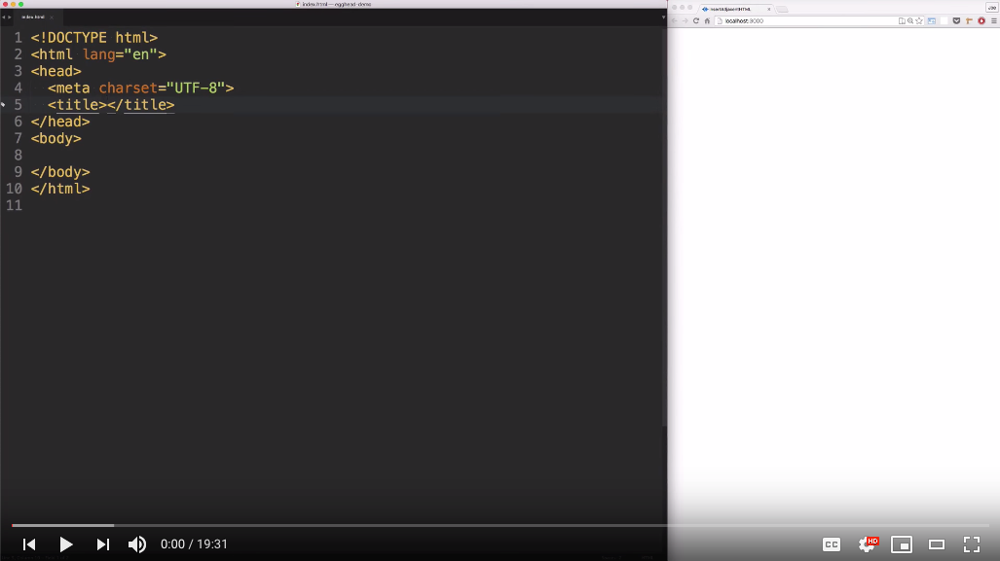

# Record your lesson

Screencasting is one of those iceberg-like tasks: 90% of the work is behind the scenes. Only 10% is visible.

Recording your screencast is that 10%. You’ve put tons of thought and time into your lesson scope, code example, and points you want to cover. What distinguishes your success in this final stage is high-quality technical tools. (And careful editing—that’s next.)

### Video capture

egghead.io instructors are provided with whatever software licenses you need. Just #ask!

**On Windows**, the best option for video capture and editing is [Camtasia](https://www.techsmith.com/video-editor.html).

**On a Mac**, the best options are [ScreenFlow](https://www.telestream.net/screenflow/) and [Camtasia](https://www.techsmith.com/video-editor.html). Both provide editing features. We tend to prefer ScreenFlow for its standalone simplicity, as Joe Maddalone shows in the video show below, but the decision is completely yours.

### Capturing audio

There are three ways to record your screencasts. Each is completely 👌

- All at once
- Audio first, video second
- Video first, audio second

**All at once** is arguably the simplest approach—just type and record the screen. You don't have to think about the video and audio separately. You just have to think about them at the same time, which might be a lot to ask. Give it a try and see how it feels to you!

**Audio first** means you play back the audio and record your video to match. The trick here is remembering what is said when, so your mouse is ready to move where it needs to.

**Video first** means you narrate over video playback. It can be challenging to sync and get a natural feeling with narration. Like most things, it takes practice.

For more on audio, see our guide to [audio setup](/set-up-your-audio).

### Record one thought at a time

While you’re recording, do your editing-self a favor: Record in short, high-quality chunks, one thought at a time.

Think of your lesson as a series of paragraphs that take 20 seconds to record. **Between each, take a pause**. Doing this will help you avoid intense editing to move audio and video snippets around as you build your quilt-like final product.

When you record in chunks, you get better short takes. (You’re not trying to set a record for the longest unedited take here.) By pausing between each section, you can visibly see where you need to [ripple delete](/edit-your-lesson).

Need an example? Watch John Lindquist show how to record one thought at a time.

